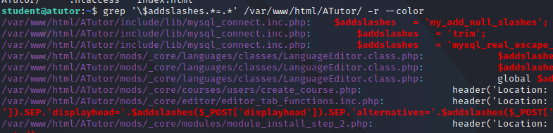
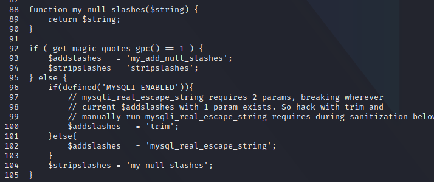
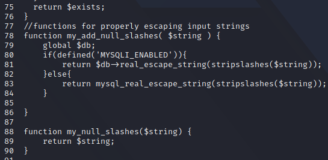
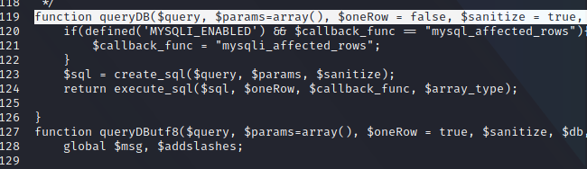
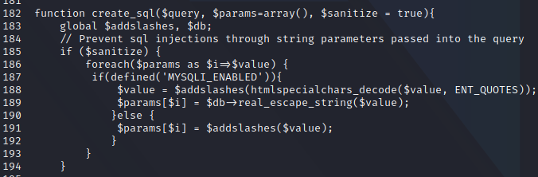
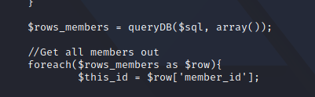

## Deprecated Magic Quotes
An important item to note here is that the called function name is stored in a variable called _$addslashes_ and that we are _not_ calling the native PHP _addslashes_ function.

Thus, we look for the definition of the addslashes function with the following grep search:
```sh
grep '\$addslashes.*=.*' /var/www/html/Atutor -r --color
```

We find the definition in mysql_connect.inc.php file:



Examining the file we find the definition of the variable:



Here, we find something interesting. On line 92 there is a check for the Magic Quotes setting.
If the Magic Quotes are on, then the _$addslashes_ is defined as _my_add_null_slashes_, a function that has been defined in the same file:



However, the code is inevitably gonna fall to the else branch. This is because the current php version being used is 5.6.17, and magic quotes have been deprecated since version 5.4.0 causing a discrepency.
The code then checks whether the global variable _MYSQLI_ENABLED_ is defined, if that's the case then _$addslashes_ becomes the _trim_ function.
Looking at the vital_func.inc.php file, we can see that the MYSQLI_ENABLED function is defined.
This is the reason that the addslashes function is doing nothing m,ore than trimming our user input.

## Improper Parameterization
However, this was not the only hurdle we need to deal with.
The application also defines and implements a function called _queryDB_, whose purpose is to enable the use of parameterized queries.
This is the function that is called any time there is a SQL query to be executed and it is defined in the file mysql_connect.inc.php as well:



If the function is used correctly, the known parts of the query(written by the developer) should be ideally passed as the $query argument, and the user-controlled parameters are passed as the $params variable(that being the 2nd argument)
The elements of the array are then properly sanitized with the create_sql function, which is also defined in the same file:



Here we can see that the _create_sql_ function correctly sanitizes each string element of the parameters array using the _real_escape_string_ function.
However, recalling our analysis of the construction of the query string in friends.inc.php, we saw that the query string was being passed as the first parameter to the queryDB function:



Once again, this avoids sanitization because the user-controlled parameters were not passed in the array.
This mistake, combined with the _$addslashes_ definition, contribute to the SQL injection vulnerability.