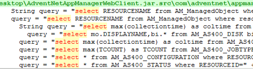
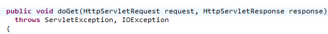
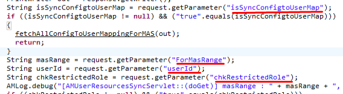
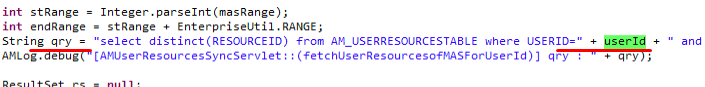
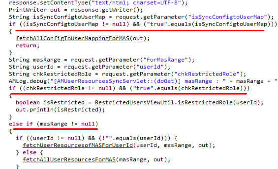

## What is ManageEngine
ManageEngine Applications Manager is an application performance monitoring solution that proactively monitors business applications and help businesses ensure their revenue-critical applications meet end user expectations. Applications Manager offers out of the box monitoring support for 80+ applications and servers.
Most URIs consist of the .do extension.

A quick Google search leads us to a file extensions explanation page, which states that the .do extension is typically a URL mapping scheme for compiled Java code.

## Source Code Recovery
We start by opening process explorer and finding the java process that's running the ManageEngine web application.
Checking properties of the only available java process, we find the working directory of the process. The directory is:

```path
C:\Program Files\ManageEngine\AppManager12\working\.
```

Most java applications use a deployment descriptor file called web.xml to determine how URLs map to servlets, which URL requires authentication, etc.
Thus, we navigate to the WEB-INF folder(the default config folder), to study the web.xml file.

Studying the contents of the lib folder, we see multiple JAR files. If we simply take a look at the names, we see that most of them are actually standard 3rd party libraries such as struts.jar and xmlsec-1.3.0.jar.
Only 4 JAR files are native to ManageEngine, one of them being AdventNetAppManagerWebClient.jar, which seems like a good starting candidate due to it's name.
We can proceed to decompile, the java classes using JD-GUI's, save all sources option.

## Looking For SQLI
At the start of our analysis, we see that all sql query strings are assigned to the "query" variable.



Looking for select statements or even query variable with regex, does not prove to be useful.
This is because he get almost 5000 hits, going through which would be overwhelming.

Thus, we can start by looking for the front-end user interface implementation and take a look at the HTTP request handlers first.
A typical java servlet uses HTTP request handler functions to handle HTTP requests.
The methods are as follows:
-   _doGet_
-   _doPost_
-   _doPut_
-   _doDelete_
-   _doCopy_
-   _doOptions_

Thus we proceed to look for all doGet and doPost functions and land up with 90 results, which is relatively understandable.

We start by analyzing all the instances of the _doGet_ function, and find an interesting one:



We start by analyzing the doGet function in _AMUserResourcesSyncServlet_ class.
The first parameter is an _HttpServletRequest_ object that contains the request a client has made to the web application.
The second one is an _HttpServletResponse_ object that contains a response the servlet will send to the client after the request is processed.

We are interested in the former, but more specifically, we are interested in the servlet code that extracts HTTP request parameters through the _getParameter_ or _getParameterValues_ methods.
So, in the doGet function, we see that there are 4 different lines where user-controlled parameters are retrieved, these being:
- isSyncConfigtoUserMap
- ForMasRange
- userId
- chkRestrictedRole



Further down, we see that the userId parameter, is being used to construct an SQL query, in the _qry_ variable:



However, we see that this query is being formed in the _fetchUserResourcesofMASForUserId_ function.
We see that this function IS called in the doGet function, however, it has a few if statements which if, are true, the code will not reach the function:



The first 2 if statements, are checks for isSyncConfigtoUserMap and chkRestrictedRole parameters.
If these 2 are set, the code will not fall to the if branch that we want it to.
This means that our malicious request cannot have these 2 parameters set.

Moreover, in the else if branch, the masRange needs to be set to for the code to fall into the part we want.
This means, that in our malicious request, the masRange parameter will have to be set.

Finally, in our concerned branch, the code checks if the userId parameter is set, and not an empty string, the function where the SQL query is constructed, will be called, with the parameters that we control.

Also, there is no sanitization for the userId parameter, before being passed into a variable.
This means that a vulnerable certainly exists.