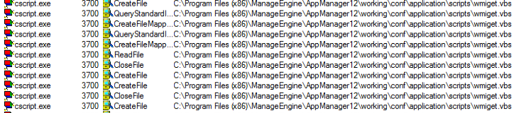
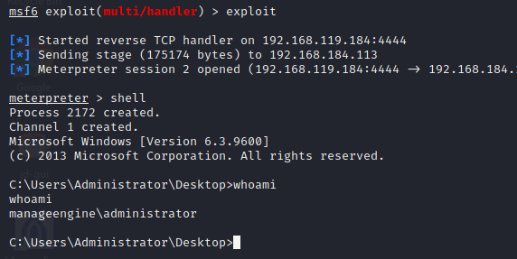
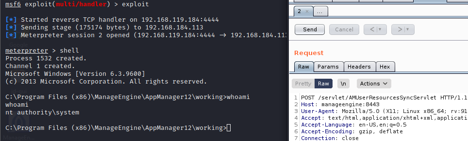

## VBA files
The first method to get a reverse shell is to introduce malicious code into the VBS files that are used by the ManageEngine application during normal operation.
These scripts are located in the following directory:

```path
C:\Program\ Files\ (x86)\ManageEngine\AppManager12\working\conf\application\scripts
```

Exploring procmon, we can see the script that we need to introduce malicious code to, to get a reverse shell:



With this, we can now navigate to the file and explore it's contents.
We do not need to understand the contents, however, we need to preserve them and add a meterpreter generated reverse shell after it, all in one line as copy to function does not take new line characters.

To make the existing wmiget.vbs(and also our reverse shell) file into a one-liner we will find and replace the following:

```
1. find and replace '.* with nothing -- will remove all the comments
2. find and replace _.*?\n with nothing -- will remove the continuation lines
3. find and replace \t with nothing -- will remove all tabs
4. find and replace \n with : -- will remove all new lines
5. find and replace \r\n with : -- will remove all carraige return
6. find and replace :: with : 
```

Once we've done this, we can then merge the contents of our shell and the wmiget file and wait for 1 minute as our shell gets executed:



Now- we can put our shellcode into the following payload:

```sql
copy+(select+convert_from(decode($$ENCODED_PAYLOAD$$,$$base64$$),$$utf-8$$))+to+$$C:\\Program+Files+(x86)\\ManageEngine\\AppManager12\\working\\conf\\\\application\\scripts\\wmiget.vbs$$;
```

We need to send our payload in a POST request as a GET request has limit and our payload crosses the URL limit.
Sending our payload, we receive the reverse shell in under 1 minute:



However, this approach may not always be possible because it is specific to the ManageEngine installations running on Windows hosts. Because of this we need a more generic approach in the remainder of this module .