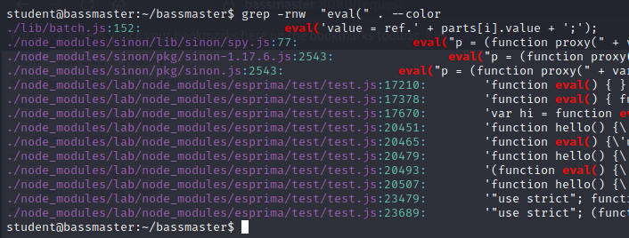
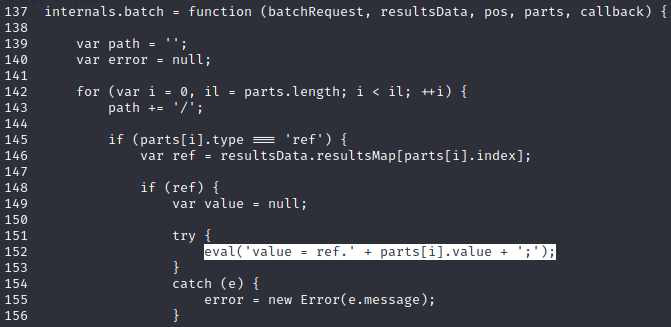
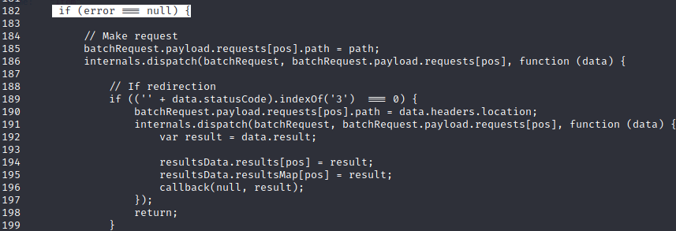
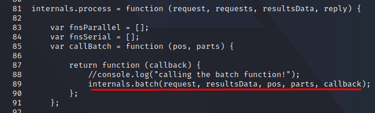
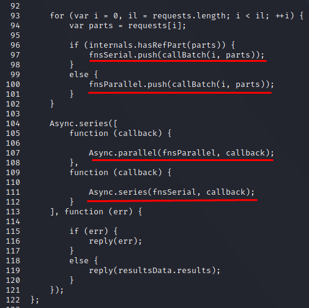

## The Bassmaster Plugin
Bassmaster is a batch processing plugin that can combine multiple requests into a single one and pass them on for further processing.
We will be compromising a JavaScript code injection.
JavaScript code injections are usually found on the client-side attack surface and involve arguably less critical vulnerability classes such as Cross-Site Scripting.
However, in our particular case, it will lead to a  server-side code execution vulnerability.

## The Vulnerability
As the source code is in JavaScript, we can start off by looking for the eval() function, as it allows the user to directly execute arbitrary code.
We start off by a simple find command that fetches us various results:

 

The first result is an interesting one which leads us to batch.js file.
Inspecting the contents of the file:

We see the implementation of the eval function, inside of the internals.batch function. The implementation of the eval function uses the parts parameter, passed to the internals.batch function.
To reach the eval function, we need to go through a couple of if statements. The code will only reach to the eval function if the type of at least one of the entries parts array is of type "ref".
However, if none of the entry is of type "ref", then the code falls to line 182, where the internals.batch function is called.

The if statement is passed as the error variable is initialized to null by default.
This is where, the important part of the code arrives.
On line 194 -195 and 202-203, the resultsData array variable gets populated based on the HTTP request, from the internals.batch function.
This will allow us to pass the check for line 152, where the eval function is implemented.

Since, here, the parts array is passed into the eval function, we need to find if we control the variable at any point in time.

Examining the rest of the batch.js file, we find that our internals.batch function is called in line 88 from the internals.process function.
In this function, the callBatch variable is defined and makes a call to internals.batch function, where parts is passed as the 4th argument, we need to find if we can control the variable, and keep track of it.

Moving on to line 92-101:

We see the arrays _fnsParallel_ and _fnsSerial_ are populated with the callBatch function, and are passed to the Async.series function, where they trigger the execution of the callBatch function.
We need to note that the fnsParallel and fnsSerial arrays are populated with the callBatch function call, where parts array is being passed as the 2nd argument.
Here, we note that the parts variable is being populated from the requests array, which is passed as the 2nd argument, to the internals.process function(as noted in the above screenshots).

Now we need to look for the execution of the internals.process function, which we can find on line 69.
However, we need to analyze how we are reaching to that function.
We see that the execution of the internals.process function is towards the end of another function, the module module.exports.config function:
