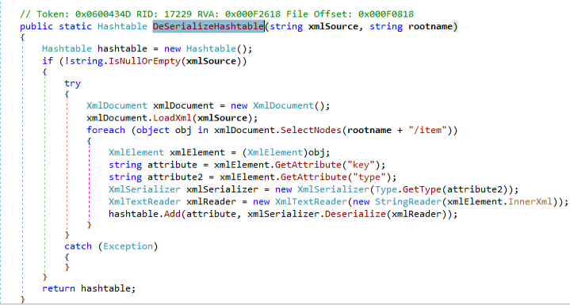

## Initializing Debugging
First off, we need to know the vulnerability is found in the processing of the _DNNPersonalization_ cookie, which as the name implies, is directly related to a user profile.
This vulnerability can be triggered without any authentication.

To debug the DNN application, we'll be using dnSpy debugger.
The entry point for this vulnerability is found in the function called _LoadProfile_, which is implemented in the DotNetNuke.dll module.
We will navigate to the binaries directory of DNN and drag the DotNetNuke.dll module into dnSpy:

We can start by _DotNetNuke.Services.Personalization.PersonalizationController_ namespace.
Here we see the implementation of the LoadProfile function:

Here we see, that the function checks for the presence of the "DNNPersonalization" cookie in the incoming HTTP request.
If the cookie is present, its value is assigned to the local _text_ string variable.
Then, the variable is passed to the DeserializeHashTableXml function.

Following the function execution path:

We see that it's only a wrapper for the DeserializeHashTable function.
We note that the second argument passed in this function call on is the hardcoded string "profile".

Continuing to follow the execution path:

We see a very similar implementation of an XmlSerializer in context to our previously discussed example.
The function processes the following steps:
1. look for every _item_ node under the _profile_ root XML tag
2. extract the serialized object type information from the _item_ node "type" attribute
3. create an _XmlSerializer_ instance based on the extracted object type information
4. deserialize the user-controlled serialized object

The vulnerability is rather clear at this point. However, we still need to attach this process to a debugger and follow the execution flow as we process our malicious cookie values that will be deserialized.

## Attaching The Debugger
