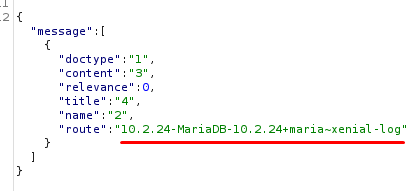

## SQL Injection
We can start by listing all whitelisted functions that can be accessed by unauthenticated users by looking for the term:
"whitelist(allow_guest)"

Looking for SQL in the results, we find a unique function:


The function starts out by defining 4 arguments:
1. text
2. scope
3. start
4. limit

Next, the web_search function splits the _text_ variable into a list of multiple search strings and begins looping through them:


Within the _for_ loop, the query string is set and the string is formatted. However, not all of the parameters are appended to the query in the same way:


In the first, query formations, the text variable is appended using the format function, but the string is first passed into an escape function.
However, in the 2nd query formations, the parameters are not escaped.
This could potentially mean an SQL injection.
Meaning, we might be able to find an sql injection inside the scope, limit and the start arguments.

To confirm we can reach the function, we can modify our burpsuite request and set a breakpoint:


We provide the path to the function in the frameworks directory searcher format.
And, the only variable in the web_search function that does not have a default value is _text_. We will set this in the Burp request by adding an ampersand (&) after the cmd value, and we will set the _text_ variable to "myText".

We notice that we hit the breakpoint, verifying that we can reach the function:


We will now set a lower breakpoint, on the line where the query is sent to the multisql function:


With the breakpoint hit, we can now step over past the formatting and enter into the multisql function:


This will take us into the apps/frappe/frappe/database/database.py file.
From here, we open the debugging tab, expand the sql_dict variable, and we can see the query being passed to the database:

```SQL
SELECT 'doctype', 'name', 'content', 'title', 'route' FROM '__global_search' WHERE 'published' = 1 AND MATCH('content') AGAINST ('\"mytext\"' IN BOOLEAN MODE) LIMIT 20 OFFSET 0
```

Continuing the execution, we also see the same query in the database logs:


We can now play with the potentially vulnerable parameters like scope.
We will again send the same burp request, however this time, we will add in the scope parameter, with a string value and analyze how the query looks like and how it can be exploited:


Looking at the log file, we find our query, and it looks like this:

```mysql
SELECT `doctype`, `name`, `content`, `title`, `route` FROM `__global_search` WHERE `published` = 1 AND  `route` like "mytext_scope%" AND MATCH(`content`) AGAINST ('\"mytext\"' IN BOOLEAN MODE)
```

We see our string value inside the query, and we also see that it can easily be exploited with a closing double quote, followed by a UNION statement.
We will also comment out the rest of the query to extract the information as our needs.

We start by sending a sample payload and reading the response.
Our sample payload will be:

```sql
mytext_scope" UNION SELECT 1,2,3,4,5#
```

As expected, we see our output inside the response:


Now that we have triggered the vulnerability, we will do one last test with another sample payload where we extract the database version with the payload:

```sql
mytext_scope" UNION SELECT 1,2,3,4,@@version#
```

As expected, we see the database version, in the response.



Now that we have triggered the vulnerability, we need to understand how to exploit it in a way that lets us authenticate as the administrator, or gives us higher level access to the application.