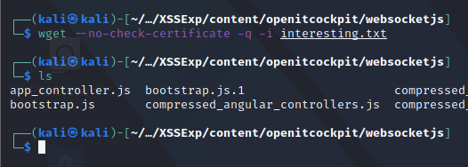

With the contents retrieved from the session riding XSS, we have the contents of an authenticated section.
We can now move on to inspecting these contents, and identifying any vulnerabilities for remote code execution.

We can start by looking at the files, and see if we find something interesting:


The most interesting files seem to be:
1. commands.html
2. cronjobs.html
3. serviceescalations.html

Reading the contents of commands.html, we find something interesting:


We find an object named appData, which contains 2 interesting variables.
1. akey : defined with an alpha numeric value
2. websocket_url : ends with sudo_server

The combination of a _commands_ route and _sudo_server_ WebSocket connection endpoint piques our interest.
Looking up the term WebSocket, we find that, a _WebSocket_ is a browser-supported communication protocol that uses HTTP for the initial connection but then creates a full-duplex connection, allowing for fast communication between the client and server
While HTTP is a stateless protocol, WebSocket is stateful.

In a properly-built solution, the initial HTTP connection would authenticate the user and each subsequent WebSocket request would not require authentication.
However, due to complexities many developers face when programming with the WebSocket protocol, they often put in their own authentication in the front end.
We see a similar case in our victim.

In a browser-based application, WebSocket connections are initiated via JavaScript.
Since JavaScript is not compiled, the source defining the WebSocket connection must be located in one of the JavaScript files loaded on this page.
Thus to understand, to find the source of the WebSocket, we will look for all the referenced JavaScript files inside the source code:
```bash
cat commands.html | grep -E "script.*src" | grep -Ev "vendor|lib|plugin" | grep -v "smartadmin"
#some more cleaning up
```


After identifying the files, we need to understand that js files are mostly never under authentication.
This means that we can access these files in a regular, unauthenticated session, and download their front end code:



With the files now downloaded, we can start looking for the definition of the WebSocket.
However, before that, the downloaded JavaScript code, is hard to read, and not formatted, and compressed, we can solve this by using jsbeutifier, or use vs code:

```bash
for f in compressed_*.js; do js-beautify $f > prettycode/"${f//compressed_}"; done;
```

Now that we have a readable version of the custom JavaScript, we can begin reviewing the files.

